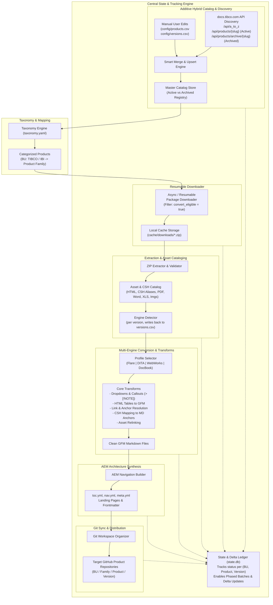

# DocuShift Architecture Document: End-to-End Documentation Migration Engine

> **Document Status:** Living Architecture Specification  
> **Last Updated:** 2026-09-03  
> **Scope:** ~250 Products across TIBCO & IBI BUs  
> **Source:** `docs.tibco.com` (Active & Archived Versions)  
> **Target:** AEM-Ready GitHub-Flavored Markdown Repositories

---

## 1. End-to-End System Architecture

DocuShift is structured into 7 modular, decoupled stages supported by an **Additive Hybrid Catalog** and a central **State & Delta Engine**:



---

## 2. Discovery Protocol & API Integration

DocuShift integrates directly with the `docs.tibco.com` REST APIs:

1. **Product Master List (`/api/a_to_z`)**:
   - Returns all active public and unversioned products, product names, slugs, and IDs.
2. **Active Product Versions (`/api/products/{slug}`)**:
   - Returns product metadata, `version_no`, `folder_path`, `isArchiveExists` flag, sibling versions, and document listings.
   - **Download All Docs ZIP Endpoint**: Built from `folder_path`:
     `https://docs.tibco.com/pub/{folder_path}/doc/zip/tib_{folder_path.replace('/', '_')}_doc.zip`
3. **Archived / "Other Versions" (`/api/products/archive/{parent_slug}`)**:
   - Returns array of archived `children` records with `version_no`, `name`, `GA_date`, and direct `zipPath`.
   - **Conversion Policy**: By default, archived versions are inventoried with `is_archived: true` and `convert_eligible: false`. Users can flip `convert_eligible: true` on specific archived versions when needed.
4. **Product Suites / Categories (`/api/product_list_by_suites`, `/api/bu_category_products`, `/product/categories#name=All`)**:
   - Maps products to major suite groups (e.g. `WebFOCUS`, `ibi`, `Spotfire`, `EMS`, `BusinessWorks`, `EBX`).
   - **Advisory only.** The majority of products carry no docsite category, so this source can never be authoritative for `family`. It may promote a product from `unclassified`, but never overrides a `manual` assignment. See §3.3.

---

## 3. Catalog Data Schema (CSV)

The catalog is stored as **two normalized CSV files**, not JSON. At ~250 products x 5-15 versions (1,500-4,000 version rows), the dominant human operations are column operations — bulk-toggling `convert_eligible` across a family, reassigning `family` for a batch, triaging unclassified products. Those are a filter and a fill-down in Excel, and near-impossible by hand in nested JSON. CSV also produces a one-line git diff when discovery finds a new version, versus a ten-line nested insert.

The pydantic models in `models.py` remain the in-memory representation; CSV is purely the on-disk form.

### 3.1 `config/products.csv` — one row per product

| Column | Owner | Notes |
| :--- | :--- | :--- |
| `product_code` | tool | Primary key; join key for `versions.csv` |
| `display_name` | tool, user-editable | e.g. `TIBCO Enterprise Message Service™` |
| `bu` | **user** | `tibco` or `ibi` |
| `family` | **user** | Must exist in `taxonomy.yaml` for this BU |
| `family_source` | tool | Provenance — see §3.3 |
| `slug` | tool | Docsite slug used for API calls |
| `custom_override` | user | Explicit whole-row pin; ignore all upstream changes |

```csv
product_code,display_name,bu,family,family_source,slug,custom_override
ems,TIBCO Enterprise Message Service™,tibco,messaging,manual,tibco-ems,false
ebx,TIBCO EBX®,tibco,data_management,taxonomy_rule,tibco-ebx,false
webfocus,ibi™ WebFOCUS®,ibi,webfocus,manual,ibi-webfocus,true
```

> **`engine` is deliberately absent here.** The source toolchain varies *between versions* of the same product — TIBCO migrated products onto Flare over time, so an older version may be WebWorks or DITA while the current one is Flare. It is therefore a `versions.csv` column. See §3.4.

### 3.2 `config/versions.csv` — one row per version

| Column | Owner | Notes |
| :--- | :--- | :--- |
| `product_code` | tool | FK to `products.csv` |
| `version` | tool | e.g. `10.4.0`; with `product_code` forms the row key |
| `is_archived` | tool | From the archive API |
| `convert_eligible` | **user** | The primary toggle. Active defaults `true`, archived defaults `false` |
| `release_date` | tool | ISO where parseable; free text otherwise (the archive API returns values like `June 2022`) |
| `engine` | tool (detected), user-overridable | `flare` \| `dita` \| `webworks` \| `docbook` \| `auto`. **Per-version, not per-product** — see §3.4 |
| `engine_source` | tool | `detected` \| `manual` \| `auto` (not yet determined) |
| `zip_url` | tool, user-editable | Resolved download endpoint |
| `custom_override` | user | Explicit row pin |
| `_bu`, `_family` | **tool, read-only** | Denormalized from `products.csv` so you can filter by family without a VLOOKUP. Regenerated on every write; **edits here are ignored** — change them in `products.csv` |

```csv
product_code,version,is_archived,convert_eligible,release_date,engine,engine_source,zip_url,custom_override,_bu,_family
ems,10.4.0,false,true,2025-11-04,flare,detected,https://docs.tibco.com/pub/ems/10.4.0/doc/zip/tib_ems_10.4.0_doc.zip,false,tibco,messaging
ems,10.2.1,true,false,2023-06-12,auto,auto,https://docs.tibco.com/pub/ems/tibco-ems-10-2-1_documentation.zip,false,tibco,messaging
ems,8.6.0,true,false,2020-04-30,webworks,detected,https://docs.tibco.com/pub/ems/tibco-ems-8-6-0_documentation.zip,false,tibco,messaging
ebx,6.2.0,false,true,2025-09-30,flare,detected,https://docs.tibco.com/pub/ebx/6.2.0/doc/zip/tib_ebx_6.2.0_doc.zip,false,tibco,data_management
```

Note the three `ems` rows: the current release is Flare, an older one is WebWorks, and the un-downloaded one is still `auto` because its engine cannot be known until the package is extracted.

**Volatile machine state is deliberately excluded** from both files. `zip_etag`, `zip_size`, checksums, per-stage status, and free-form metadata live in `state.db`. This is what keeps the CSVs stable enough to leave open in a spreadsheet — a `catalog fetch` touches them only when discovery finds a genuinely new product or version.

### 3.3 Family Classification & Provenance

Classification is a **majority-manual triage job**: most products carry no docsite category, so no automated source can populate `family` reliably. `family_source` records how each assignment was reached, in strict precedence order (first match wins):

| `family_source` | Meaning | Overwritable by fetch? |
| :--- | :--- | :--- |
| `manual` | Set by a human | **Never** |
| `taxonomy_rule` | Matched a keyword rule in `taxonomy.yaml` | Yes |
| `docsite_category` | Docsite category data supplied one (minority of products) | Yes |
| `unclassified` | Fell through everything — **needs triage** | Yes |

This makes triage a spreadsheet filter, and makes progress reportable (`docushift catalog triage` → "187 of 250 unclassified").

Consequently `config/taxonomy.yaml` holds **family definitions and keyword inference rules only** — it no longer carries per-product mappings, since maintaining 250 hand-classified products in four-level nested YAML recreates the exact pain CSV was chosen to avoid. The ibi/WebFOCUS/Omni/iWay heuristics formerly hardcoded in `config.py:resolve_product_info()` are now YAML rule data.

A rule lists `match` tokens plus the `bu` and `family` to assign. Each token is compared case-insensitively against the `product_code` as an exact match, and against the display name as a substring; the first rule to match wins, so specific rules are ordered above broad ones. A product matching nothing is written `unclassified` rather than guessed into a family.

Because two automated sources can disagree, `family` is the one field the merge resolves by **provenance rank** rather than by snapshot comparison: a fetch may only raise a product's classification confidence, never lower it.

### 3.4 Engine Resolution (Per-Version, Detected)

**The source toolchain is a property of a version, not of a product.** TIBCO migrated products onto MadCap Flare progressively, so a single product's history commonly spans generators — an 8.x doc set built with FrameMaker + WebWorks, a 9.x set from DITA, and a 10.x set from Flare. Modelling `engine` on the product would apply the wrong converter to every older version.

It is also **detected, not declared**. Across 1,500-4,000 versions, hand-assignment is infeasible, and a wrong default is silently destructive: feeding a WebWorks set to the Flare engine produces plausible-looking but incorrect Markdown with no error. The default is therefore `auto`, never `flare`.

**Resolution order** (first match wins):

| `engine_source` | Meaning | Overwritable by detection? |
| :--- | :--- | :--- |
| `manual` | A human corrected it | **Never** |
| `detected` | `engines/detector.py` identified it from extracted content | Yes, on re-extract |
| `auto` | Not yet determined — package not downloaded/extracted | Yes |

**Detection signals**, ordered by reliability (marker files first, they are cheapest and least ambiguous):

| Engine | Marker files / directories | Content signature |
| :--- | :--- | :--- |
| Flare | `*.mcwebhelp`, `*.mclog`, `Skins/`, `Data/`, `MicroContent/`, `_globalpages/`, `csh.js` | `MadCap` namespace and `MadCap:*` attributes |
| WebWorks | `wwhelp/`, `wwhdata/` | `WebWorks` generator meta tag |
| DITA-OT | `*.dita` remnants, DITA metadata files | DITA-OT generator comment |
| DocBook | — (flat HTML output) | `DocBook XSL Stylesheets` generator comment |

Verified against the cached `dsp_gridserver` 7.1.1 sample: all six Flare marker paths present, and a `MadCap` reference in **197 of 197** `admin-guide` files. Marker-file detection alone is decisive there; the content signature serves as corroboration and as the fallback for DocBook, which has no distinctive file layout.

**Pipeline consequence:** `engine` cannot be populated at Stage 1 (Discovery) because it requires the package contents. It is written back into `versions.csv` after Stage 4 (Extraction), making the catalog a mid-pipeline write target rather than a discovery-time artifact. Stage 5 then reads it to select the converter.

**Granularity caveat:** one version's ZIP may bundle multiple guides. In the `dsp_gridserver` sample these are nine sibling folders (`admin-guide`, `dev-guide`, `install-guide`, `com-tutorial`, …) of a *single* Flare output, so per-version resolution is correct. Should a bundle ever mix generators across guides, the detector records the per-folder map in `state.db` and sets the dominant engine in the CSV; handling genuinely mixed bundles is deferred until one is observed.

### 3.5 Snapshot-Based 3-Way Merge

`state.db` retains the **last-fetched value of every field**. On `catalog fetch`, each field is resolved from three inputs:

- **base** — what discovery wrote last time (snapshot)
- **theirs** — what discovery returns now
- **mine** — what the CSV currently says

If `mine != base`, the field was edited by a human and is preserved. Otherwise `theirs` wins. No `custom_override` flag is required for this to work — expecting a user to remember to tick a protection column on each edited row of a 4,000-row sheet guarantees silent data loss. `custom_override` survives only as an explicit "pin this entire row" escape hatch.

Three properties of the implementation matter:

- **Resolution is per field, not per row.** Editing `display_name` must not also freeze the `slug` beside it.
- **With no snapshot, `mine` wins** unless it is empty. A missing base means the row predates the state DB (or the DB was discarded); inventing one would silently overwrite edits. Only genuinely blank cells are filled from the fetch.
- **The merge covers only what discovery owns**: `display_name`, `slug`, `is_archived`, `convert_eligible`, `release_date`, `zip_url`. `engine`/`engine_source` are excluded, and `version_snapshot` carries no engine columns at all — a fetch structurally cannot reset a detected engine (§3.4).

Deletion detection is scoped to the products present in the current fetch, so `catalog fetch --product ems` cannot read every other product's absence as a removal.

### 3.6 CSV Round-Trip Hygiene

Excel is the expected editor, which imposes hard requirements:

| Hazard | Defense |
| :--- | :--- |
| `TIBCO EBX®` renders as `TIBCO EBX®` on double-click open | Write `utf-8-sig` (BOM); read `utf-8-sig`, which also tolerates a missing BOM |
| Version `1.10` coerced to a number, saved back as `1.1` | Importer diffs version keys against the last-known set; orphaned keys **abort the import** rather than silently deleting |
| `2025-11-04` reformatted to `11/4/2025` by locale | Parse permissively, always write ISO; pass unparseable values through verbatim |
| Excel writes `TRUE` / `FALSE` | Read case-insensitively (`true`/`1`/`yes`/`y`); always write lowercase `true`/`false` |
| Row deleted to mean "skip this" | Deletion requires `--allow-deletes`; the supported way to exclude is `convert_eligible=false` |
| Diff churn on every fetch | Fixed column order; stable sort — products by `(bu, family, product_code)`, versions by `(product_code, version desc)` using natural version sort so `10.4.0` sorts above `9.1.0` |

---

## 4. Multi-Engine Conversion & Asset Handling

The converter for a package is chosen from that **version's** `engine` value, resolved by `engines/detector.py` during extraction (§3.4) — not from any product-level setting. A version whose engine is still `auto` is skipped with a warning rather than guessed at, since a wrong guess yields silently malformed Markdown.

### 4.1 MadCap Flare Engine (`engines/flare.py`)
- **Dropdown Extraction**: Unrolls `MCDropDown` structures into native Markdown headings or sections.
- **Proxy Stripping**: Removes `MadCap:topicToolbarProxy`, breadcrumb proxies, search bars, and skin templates.
- **Callout Normalization**: Maps Flare `.note`, `.tip`, `.warning`, `.caution` classes to standard GFM alerts (`> [!NOTE]`, `> [!WARNING]`, etc.).
- **Table Normalization**: Formats Flare table styles into clean GFM pipe tables.
- **CSH Linkage**: Preserves Flare `Alias.xml` / `CSH.js` identifier-to-target anchor mapping.

### 4.2 Universal Asset Preservation
- Copies referenced assets (`PDF`, `DOC`, `DOCX`, `XLS`, `XLSX`, `TXT`, `PNG`, `SVG`, `ZIP`) and rewrites relative markdown paths.

---

## 5. AEM Structure Synthesis & Git Sync
- Synthesizes `toc.yml`, `nav.yml`, `meta.yml`, `index.md`, and YAML frontmatter.
- Distributes ready-to-push documentation sets into `{target_git}/{bu}/{family}/{product}/{version}/`.
