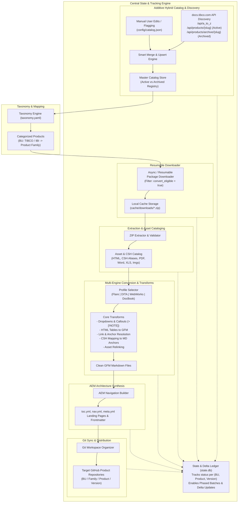

# DocuShift Architecture Document: End-to-End Documentation Migration Engine

> **Document Status:** Living Architecture Specification  
> **Last Updated:** 2026-09-02  
> **Scope:** ~250 Products across TIBCO & IBI BUs  
> **Source:** `docs.tibco.com` (Active & Archived Versions)  
> **Target:** AEM-Ready GitHub-Flavored Markdown Repositories

---

## 1. End-to-End System Architecture

DocuShift is structured into 7 modular, decoupled stages supported by an **Additive Hybrid Catalog** and a central **State & Delta Engine**:



---

## 2. Discovery Protocol & API Integration

DocuShift integrates directly with the `docs.tibco.com` REST APIs:

1. **Product Master List (`/api/a_to_z`)**:
   - Returns all active public and unversioned products, product names, slugs, and IDs.
2. **Active Product Versions (`/api/products/{slug}`)**:
   - Returns product metadata, `version_no`, `folder_path`, `isArchiveExists` flag, sibling versions, and document listings.
   - **Download All Docs ZIP Endpoint**: Built from `folder_path`:
     `https://docs.tibco.com/pub/{folder_path}/doc/zip/tib_{folder_path.replace('/', '_')}_doc.zip`
3. **Archived / "Other Versions" (`/api/products/archive/{parent_slug}`)**:
   - Returns array of archived `children` records with `version_no`, `name`, `GA_date`, and direct `zipPath`.
   - **Conversion Policy**: By default, archived versions are inventoried with `is_archived: true` and `convert_eligible: false`. Users can flip `convert_eligible: true` on specific archived versions when needed.
4. **Product Suites / Categories (`/api/product_list_by_suites`)**:
   - Maps products to major suite groups (e.g. `WebFOCUS`, `ibi`, `Spotfire`, `EMS`, `BusinessWorks`, `EBX`) to assist auto-categorization.

---

## 3. Catalog Data Schema (`config/catalog.json`)

```json
{
  "version": "1.0",
  "last_updated": "2026-09-02T22:40:00Z",
  "products": {
    "businessevents-enterprise": {
      "product_code": "businessevents-enterprise",
      "display_name": "TIBCO BusinessEvents® Enterprise Edition",
      "bu": "tibco",
      "family": "integration",
      "engine": "flare",
      "custom_override": false,
      "versions": {
        "6.4.0": {
          "version": "6.4.0",
          "title": "TIBCO BusinessEvents® Enterprise Edition 6.4.0 Documentation",
          "zip_url": "https://docs.tibco.com/pub/businessevents-enterprise/6.4.0/doc/zip/tib_businessevents-enterprise_6.4.0_doc.zip",
          "release_date": "2025-12-19",
          "is_archived": false,
          "convert_eligible": true,
          "source": "tool_fetch",
          "custom_override": false
        },
        "6.2.2": {
          "version": "6.2.2",
          "title": "TIBCO BusinessEvents® Enterprise Edition 6.2.2",
          "zip_url": "https://docs.tibco.com/pub/businessevents-enterprise/tibco-businessevents-enterprise-edition-6-2-2_documentation.zip",
          "release_date": "June 2022",
          "is_archived": true,
          "convert_eligible": false,
          "source": "tool_fetch",
          "custom_override": false
        }
      }
    }
  }
}
```

---

## 4. Multi-Engine Conversion & Asset Handling

### 4.1 MadCap Flare Engine (`engines/flare.py`)
- **Dropdown Extraction**: Unrolls `MCDropDown` structures into native Markdown headings or sections.
- **Proxy Stripping**: Removes `MadCap:topicToolbarProxy`, breadcrumb proxies, search bars, and skin templates.
- **Callout Normalization**: Maps Flare `.note`, `.tip`, `.warning`, `.caution` classes to standard GFM alerts (`> [!NOTE]`, `> [!WARNING]`, etc.).
- **Table Normalization**: Formats Flare table styles into clean GFM pipe tables.
- **CSH Linkage**: Preserves Flare `Alias.xml` / `CSH.js` identifier-to-target anchor mapping.

### 4.2 Universal Asset Preservation
- Copies referenced assets (`PDF`, `DOC`, `DOCX`, `XLS`, `XLSX`, `TXT`, `PNG`, `SVG`, `ZIP`) and rewrites relative markdown paths.

---

## 5. AEM Structure Synthesis & Git Sync
- Synthesizes `toc.yml`, `nav.yml`, `meta.yml`, `index.md`, and YAML frontmatter.
- Distributes ready-to-push documentation sets into `{target_git}/{bu}/{family}/{product}/{version}/`.
