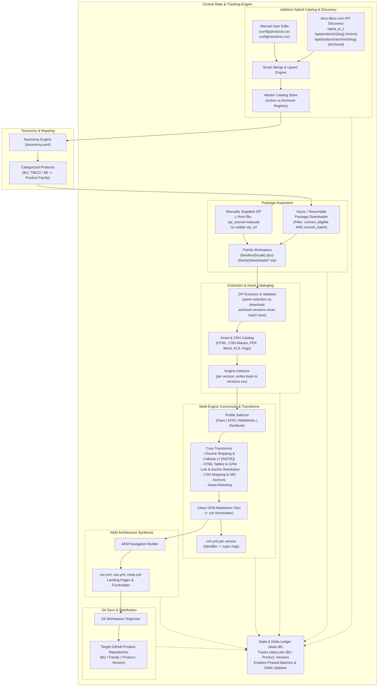

# DocuShift Architecture Document: End-to-End Documentation Migration Engine

> **Document Status:** Living Architecture Specification  
> **Last Updated:** 2026-09-03  
> **Scope:** ~250 Products across TIBCO & IBI BUs  
> **Source:** `docs.tibco.com` (Active & Archived Versions)  
> **Target:** AEM-Ready GitHub-Flavored Markdown Repositories

> This document holds the **shapes and the reasoning** — what each part of the system is, and why it is that way. The **step-by-step procedures** live in [`design.md`](design.md): the ordered algorithms, their tie-breaks, and their behaviour on malformed input, each marked Built or Specified.

---

## 1. End-to-End System Architecture

DocuShift is structured into 7 modular, decoupled stages supported by an **Additive Hybrid Catalog** and a central **State & Delta Engine**:



---

## 2. Discovery Protocol & API Integration

DocuShift integrates directly with the `docs.tibco.com` REST APIs:

1. **Product Master List (`/api/a_to_z`)**:
   - Returns all active public and unversioned products, product names, slugs, and IDs.
2. **Active Product Versions (`/api/products/{slug}`)**:
   - Returns the **current version as the product object itself** — `version_no`, `folder_path`, `isArchiveExists`, document listings — with every other release under `siblings`. See §2.1.
   - **Download All Docs ZIP Endpoint**: Built from `folder_path`, but only for active versions and only when the path is version-shaped:
     `https://docs.tibco.com/pub/{folder_path}/doc/zip/tib_{folder_path.replace('/', '_')}_doc.zip`
3. **Archived / "Other Versions" (`/api/products/archive/{parent_slug}`)**:
   - Returns `result.product.children`: archived records with `version_no`, `name`, `GA_date`, and a direct `zipPath` — the only trustworthy source of an archived version's URL.
   - **Conversion Policy**: By default, archived versions are inventoried with `is_archived: true` and `convert_eligible: false`. Users can flip `convert_eligible: true` on specific archived versions when needed.
4. **Product Suites / Categories (`/api/product_list_by_suites`, `/api/bu_category_products`, `/product/categories#name=All`)**:
   - Maps products to major suite groups (e.g. `WebFOCUS`, `ibi`, `Spotfire`, `EMS`, `BusinessWorks`, `EBX`).
   - **Advisory only.** The majority of products carry no docsite category, so this source can never be authoritative for `family`. It may promote a product from `unclassified`, but never overrides a `manual` assignment. See §3.3.

### 2.1 What the payloads actually look like

Verified against the live API on 2026-09-03, using `tibco-enterprise-message-service` as the reference product. Several of these are not what the endpoint names suggest, and each one changes how the crawler is written:

| Observed | Consequence |
| :--- | :--- |
| Every response is wrapped: `{"result": {"success": …, "product"\|"products": …}}` | The crawler peels a named envelope before reading anything. |
| `/api/products/{slug}` returns **the current version as the product object** — it carries `version_no` and `folder_path` itself — with every *other* release under `siblings` | The record set is `[detail] + siblings`. Reading only `siblings` would silently drop the newest version of every product. |
| `siblings` mixes active and archived releases, separated by an `isArchive` flag | Archive status is per record, not per endpoint. |
| Archived siblings carry **stale** folder paths (`enterprise_message_service`, `ems-zlinux` instead of `ems/8.2.1`) | An active ZIP URL is only templated from a path that looks like `<code>/<version>`. Archived rows get their URL from the archive index instead, never from a template — a guessed URL would be recorded in the catalog as fact and fail much later. |
| The archive index **overlaps** `siblings` rather than replacing it | The two are merged by version number: a version already known is topped up with the index's `zipPath` and `GA_date`, and an active record is never demoted to archived. |
| `published_date` on old releases is a bulk-migration timestamp (every EMS 5.x and 6.x row reads `2022-05-26`) | It is excluded from the release-date candidates, so the archive index's `GA_date` supplies the real month. |
| 70 of the 739 A-to-Z entries have `isPublicLevel: false`, and requesting one returns an **SSO interstitial as HTTP 200** | They are filtered out before the request. A missing flag is treated as public, so a schema change cannot silently empty the crawl. |
| Key spellings differ per endpoint (`version_no` / `versionNumber`, `folder_path` / `folderPath`) | Field reads match a small list of candidate names. The API is undocumented; being strict would mean a release every time a field is renamed. |

Two policies fall out of this and are worth stating separately, because they are what keep a bad crawl from becoming a bad catalog:

- **A product that cannot be reached is excluded from the result, not returned empty.** An empty version list would read to the merge as "every version was deleted upstream" and abort the whole fetch (§3.5).
- **`catalog fetch` requires a scope.** `--product` and `--batch` are resolved to crawl selectors *before* the per-product request, so a three-product batch costs three requests rather than 668. Because a product's code is rarely its slug (`ems` is published as `tibco-enterprise-message-service`), the selector set carries both the code and the slug already recorded in the catalog.

---

## 3. Catalog Data Schema (CSV)

The catalog is stored as **two normalized CSV files**, not JSON. At ~250 products x 5-15 versions (1,500-4,000 version rows), the dominant human operations are column operations — bulk-toggling `convert_eligible` across a family, reassigning `family` for a batch, triaging unclassified products. Those are a filter and a fill-down in Excel, and near-impossible by hand in nested JSON. CSV also produces a one-line git diff when discovery finds a new version, versus a ten-line nested insert.

The pydantic models in `models.py` remain the in-memory representation; CSV is purely the on-disk form.

### 3.1 `config/products.csv` — one row per product

| Column | Owner | Notes |
| :--- | :--- | :--- |
| `product_code` | tool | Primary key; join key for `versions.csv` |
| `display_name` | tool, user-editable | e.g. `TIBCO Enterprise Message Service™` |
| `bu` | **user** | `tibco` or `ibi` |
| `family` | **user** | Must exist in `taxonomy.yaml` for this BU |
| `family_source` | tool | Provenance — see §3.3 |
| `slug` | tool | Docsite slug used for API calls |
| `custom_override` | user | Explicit whole-row pin; ignore all upstream changes |

```csv
product_code,display_name,bu,family,family_source,slug,custom_override
ems,TIBCO Enterprise Message Service™,tibco,messaging,manual,tibco-ems,false
ebx,TIBCO EBX®,tibco,data_management,taxonomy_rule,tibco-ebx,false
webfocus,ibi™ WebFOCUS®,ibi,webfocus,manual,ibi-webfocus,true
```

> **`engine` is deliberately absent here.** The source toolchain varies *between versions* of the same product — TIBCO migrated products onto Flare over time, so an older version may be WebWorks or DITA while the current one is Flare. It is therefore a `versions.csv` column. See §3.4.

### 3.2 `config/versions.csv` — one row per version

| Column | Owner | Notes |
| :--- | :--- | :--- |
| `product_code` | tool | FK to `products.csv` |
| `version` | tool | e.g. `10.4.0`; with `product_code` forms the row key |
| `is_archived` | tool | From the archive API |
| `convert_eligible` | **user** | Policy gate: *may* this version ever be converted? Active defaults `true`, archived defaults `false` |
| `convert_batch` | **user** | Scheduling: which run this version belongs to, e.g. `poc-1`. Empty = not scheduled. Free text, lowercased on write — see §3.7 |
| `release_date` | tool | ISO where parseable; free text otherwise (the archive API returns values like `June 2022`) |
| `engine` | tool (detected), user-overridable | `flare` \| `dita` \| `webworks` \| `docbook` (convertible), `r-help` \| `robohelp` \| `frontpage` \| `help-and-manual` \| `mkdocs` \| `docusaurus` \| `doxia` \| `other` (identified, no handler), or `auto` (undetected). **Per-version, not per-product** — see §3.4 |
| `engine_source` | tool | `detected` \| `manual` \| `auto` (not yet determined) |
| `zip_url` | tool, user-editable | Resolved download endpoint. May be empty when `zip_source=manual` |
| `zip_source` | **user** | `auto` (fetch from `zip_url`) \| `manual` (package supplied by hand; never fetched) — see §3.8 |
| `custom_override` | user | Explicit row pin |
| `_bu`, `_family` | **tool, read-only** | Denormalized from `products.csv` so you can filter by family without a VLOOKUP. Regenerated on every write; **edits here are ignored** — change them in `products.csv` |
| `_has_csh` | **tool, read-only** | Stage 4: a CSH source file was found in this package — Flare `Alias.xml`, DITA `head.js` or WebWorks `topics.js` — even an empty one. Blank until extracted — see §3.9 |
| `_csh_names` | **tool, read-only** | Stage 4: distinct help identifiers parsed out of those sources |
| `_has_api_ref` | **tool, read-only** | Stage 4: the package carries an API-reference tree (Javadoc, C / Go / `tibdg`) — never converted, routed to the `api-references` doc-class (§6.2) |
| `_api_files` | **tool, read-only** | Stage 4: files under those API-reference paths |
| `_doc_files` | **tool, read-only** | Stage 4: every other file in the extracted tree |

```csv
product_code,version,is_archived,convert_eligible,convert_batch,release_date,engine,engine_source,zip_url,zip_source,custom_override,_bu,_family,_has_csh,_csh_names,_has_api_ref,_api_files,_doc_files
ems,10.4.0,false,true,poc-1,2025-11-04,flare,detected,https://docs.tibco.com/pub/ems/10.4.0/doc/zip/tib_ems_10.4.0_doc.zip,auto,false,tibco,messaging,true,412,true,4310,19776
ems,10.2.1,true,false,,2023-06-12,auto,auto,https://docs.tibco.com/pub/ems/tibco-ems-10-2-1_documentation.zip,auto,false,tibco,messaging,,,,,
ems,8.6.0,true,false,,2020-04-30,webworks,detected,https://docs.tibco.com/pub/ems/tibco-ems-8-6-0_documentation.zip,auto,false,tibco,messaging,,,,,
ebx,6.2.0,false,true,poc-1,2025-09-30,flare,detected,,manual,false,tibco,data_management,true,0,false,0,8104
```

Note the three `ems` rows: the current release is Flare, an older one is WebWorks, and the un-downloaded one is still `auto` because its engine cannot be known until the package is extracted. Two rows carry `convert_batch=poc-1`; `docushift download --batch poc-1` selects exactly those two and nothing else. The two archived rows have **blank** inventory columns because nothing has ever unpacked them — blank and `0` are different answers (§3.9).

The `ebx` row shows the other acquisition path: it is convert-eligible with **no** `zip_url`, because discovery never produced a working one and the ZIP was handed to the tool directly. `zip_source=manual` is what makes that a valid state rather than a validation failure — see §3.8. It also shows `_has_csh=true` with `_csh_names=0`: an alias file exists but yielded no identifiers.

**Volatile machine state is deliberately excluded** from both files. `zip_etag`, `zip_size`, checksums, per-stage status, and free-form metadata live in `state.db`. This is what keeps the CSVs stable enough to leave open in a spreadsheet — a `catalog fetch` touches them only when discovery finds a genuinely new product or version.

The five `_`-prefixed inventory columns are the deliberate exception, and the test they pass is the same one: **a fetch never touches them.** They change only when `docushift extract` runs, which is a real state change worth a diff. They earn a place in the sheet rather than in `state.db` because they are not machine bookkeeping — they are the inputs to the two decisions the sheet exists to record, `convert_eligible` and `convert_batch`. A number you must run a query to see is a number nobody consults before tagging 200 rows into `wave-2`.

### 3.3 Family Classification & Provenance

Classification is a **majority-manual triage job**: most products carry no docsite category, so no automated source can populate `family` reliably. `family_source` records how each assignment was reached, in strict precedence order (first match wins):

| `family_source` | Meaning | Overwritable by fetch? |
| :--- | :--- | :--- |
| `manual` | Set by a human | **Never** |
| `taxonomy_rule` | Matched a keyword rule in `taxonomy.yaml` | Yes |
| `docsite_category` | Docsite category data supplied one (minority of products) | Yes |
| `unclassified` | Fell through everything — **needs triage** | Yes |

This makes triage a spreadsheet filter, and makes progress reportable (`docushift catalog triage` → "187 of 250 unclassified").

Consequently `config/taxonomy.yaml` holds **family definitions and keyword inference rules only** — it no longer carries per-product mappings, since maintaining 250 hand-classified products in four-level nested YAML recreates the exact pain CSV was chosen to avoid. The ibi/WebFOCUS/Omni/iWay heuristics formerly hardcoded in `config.py:resolve_product_info()` are now YAML rule data.

A rule lists `match` tokens plus the `bu` and `family` to assign. Each token is compared case-insensitively against the `product_code` as an exact match, and against the display name as a substring; the first rule to match wins, so specific rules are ordered above broad ones. A product matching nothing is written `unclassified` rather than guessed into a family.

Because two automated sources can disagree, `family` is the one field the merge resolves by **provenance rank** rather than by snapshot comparison: a fetch may only raise a product's classification confidence, never lower it.

### 3.4 Engine Resolution (Per-Version, Detected)

**The source toolchain is a property of a version, not of a product.** TIBCO migrated products onto MadCap Flare progressively, so a single product's history commonly spans generators — an 8.x doc set built with FrameMaker + WebWorks, a 9.x set from DITA, and a 10.x set from Flare. Modelling `engine` on the product would apply the wrong converter to every older version.

It is also **detected, not declared**. Across 1,500-4,000 versions, hand-assignment is infeasible, and a wrong default is silently destructive: feeding a WebWorks set to the Flare engine produces plausible-looking but incorrect Markdown with no error. The default is therefore `auto`, never `flare`.

**Resolution order** (first match wins):

| `engine_source` | Meaning | Overwritable by detection? |
| :--- | :--- | :--- |
| `manual` | A human corrected it | **Never** |
| `detected` | `engines/detector.py` identified it from extracted content | Yes, on re-extract |
| `auto` | Not yet determined — package not downloaded/extracted | Yes |

**Detection signals**, ordered by reliability (marker files first, they are cheapest and least ambiguous). The version counts are a full-cache sweep of 2026-09-08 — 1,822 versions, of which 539 carry no HTML at all:

| Engine | Marker files / directories | Content signature | Versions |
| :--- | :--- | :--- | ---: |
| Flare | `*.mcwebhelp`, `*.mclog`, `MicroContent/`, `_globalpages/`, `csh.js` — **not** `Skins/` or `Data/`, see §5.1.2 | `MadCap` namespace and `MadCap:*` attributes | 595 |
| DITA (SDL) | `GUID-*.html` filenames, `static/head.js` + `static/body.js` | `DC.Type` / `DC.Identifier` / `DC.Title` meta tags (**case-insensitively** — see §5.2.1) | 371 |
| WebWorks | `wwhelp/`, `wwhdata/` | `WebWorks` generator meta tag | 176 |
| R help | `snext.css`, `snextchm.css` | `class="RdName"`, `class="RdTitle"` | 11 |
| DocBook | — (flat HTML output) | `DocBook XSL Stylesheets` generator comment | 10 |

Verified against the cached `dsp_gridserver` 7.1.1 sample: all six Flare marker paths present, and a `MadCap` reference in **197 of 197** `admin-guide` files. Marker-file detection alone is decisive there; the content signature serves as corroboration and as the fallback for DocBook, which has no distinctive file layout.

**The Flare row is the correction the 2026-09-08 Flare survey forced** (§5.1.2). The original seven-marker list matches **689 versions, of which only 595 hold a Flare runtime** — `Skins/` is 91.4% precise and `Data/` 88.0% under case-insensitive matching, because both are generic directory names other publishers also use. **All 94 false positives come from those two markers and no other**, and dropping them costs no recall whatever: `*.mcwebhelp` alone finds all 595, and `csh.js` alone finds all 595. The `Versions` count above is now the number holding a Flare runtime, which is the population the engine converts.

**The DITA row is the correction the sweep forced.** The original signals looked for DITA the way DITA-OT leaves it — `.dita` remnants and the DITA-OT generator comment. TIBCO publishes DITA through SDL's publisher, which emits neither, so the second-largest engine in the corpus (371 versions, 61,712 HTML files — more than WebWorks) was detecting as `auto`. Adding the SDL signals plus R help takes coverage of HTML-bearing versions from **68% to 98%**; `design.md` §7.2 has the per-signal hit counts and the two rules that were considered and rejected.

**The 371 is two different publishers, and the `engine` value alone does not separate them.** The 2026-09-08 DITA survey (§5.2) resolved the row into **316 SDL SuiteHelp versions** (`GUID-*.html`, flat doc-set) and **~55 file-named versions** (word-per-topic filenames under `topics/`, lowercase `DC.*` meta), all of the latter in the Spotfire family. Both are DITA and share a class vocabulary; their *layouts* differ enough to need separate handling, so `engines/dita.py` branches on which one it is rather than on the `engine` column. The detector is unchanged — the union is what the rule was always matching.

> The `DC.*` content signature must be matched **case-insensitively**. The file-named flavour writes `name="DC.type"` and `name="DC.identifier"`; a case-sensitive `DC.Type` misses all 66 of its versions, which is exactly the mistake made while surveying for §5.2 — it briefly produced a "371 is really 316" correction that was itself wrong.

**`auto` is not the only unconvertible value, and that is the point.** The residue the sweep identified by `<meta name="generator">` — RoboHelp, FrontPage, Help & Manual, MkDocs, Docusaurus, Doxia, 19 versions in all — gets real `engine` values even though Stage 5 has no handler for any of them. Collapsing them into `auto` would destroy the distinction the column exists to carry: `auto` means *we could not tell*, which is a detector bug worth chasing, while `mkdocs` means *we know exactly what this is and chose not to build for it*, which is a scoping call for a human. Both skip conversion. Only one is a defect, and `versions.csv` is where that gets reviewed — `warnings()` names any convert-eligible row whose engine has no handler, because such a row otherwise reads as settled and silently produces nothing.

**Pipeline consequence:** `engine` cannot be populated at Stage 1 (Discovery) because it requires the package contents. It is written back into `versions.csv` after Stage 4 (Extraction), making the catalog a mid-pipeline write target rather than a discovery-time artifact. Stage 5 then reads it to select the converter.

**Granularity caveat:** one version's ZIP may bundle multiple guides. In the `dsp_gridserver` sample these are nine sibling folders (`admin-guide`, `dev-guide`, `install-guide`, `com-tutorial`, …) of a *single* Flare output, so per-version resolution is correct. Should a bundle ever mix generators across guides, the detector records the per-folder map in `state.db` and sets the dominant engine in the CSV; handling genuinely mixed bundles is deferred until one is observed.

### 3.5 Snapshot-Based 3-Way Merge

`state.db` retains the **last-fetched value of every field**. On `catalog fetch`, each field is resolved from three inputs:

- **base** — what discovery wrote last time (snapshot)
- **theirs** — what discovery returns now
- **mine** — what the CSV currently says

If `mine != base`, the field was edited by a human and is preserved. Otherwise `theirs` wins. No `custom_override` flag is required for this to work — expecting a user to remember to tick a protection column on each edited row of a 4,000-row sheet guarantees silent data loss. `custom_override` survives only as an explicit "pin this entire row" escape hatch.

Three properties of the implementation matter:

- **Resolution is per field, not per row.** Editing `display_name` must not also freeze the `slug` beside it.
- **With no snapshot, `mine` wins** unless it is empty. A missing base means the row predates the state DB (or the DB was discarded); inventing one would silently overwrite edits. Only genuinely blank cells are filled from the fetch.
- **The merge covers only what discovery owns**: `display_name`, `slug`, `is_archived`, `convert_eligible`, `release_date`, `zip_url`. Four columns are excluded structurally rather than by rule, and `version_snapshot` carries none of them: `engine`/`engine_source`, because the detector writes them *after* discovery (§3.4); `convert_batch`, because no automated stage writes it at all (§3.7); and `zip_source`, because it records a human's supply decision that a fetch has no standing to revoke (§3.8). A fetch therefore cannot reset a detected engine, clear a batch tag, or silently re-point a hand-supplied package at a URL. The five inventory columns of §3.9 are excluded on the same grounds and for the same reason as the engine columns — Stage 4 writes them, and discovery has never opened the package.

Deletion detection is scoped to the products present in the current fetch, so `catalog fetch --product ems` cannot read every other product's absence as a removal.

### 3.6 CSV Round-Trip Hygiene

Excel is the expected editor, which imposes hard requirements:

| Hazard | Defense |
| :--- | :--- |
| `TIBCO EBX®` renders as `TIBCO EBX®` on double-click open | Write `utf-8-sig` (BOM); read `utf-8-sig`, which also tolerates a missing BOM |
| Version `1.10` coerced to a number, saved back as `1.1` | Importer diffs version keys against the last-known set; orphaned keys **abort the import** rather than silently deleting |
| `2025-11-04` reformatted to `11/4/2025` by locale | Parse permissively, always write ISO; pass unparseable values through verbatim |
| Excel writes `TRUE` / `FALSE` | Read case-insensitively (`true`/`1`/`yes`/`y`); always write lowercase `true`/`false` |
| Row deleted to mean "skip this" | Deletion requires `--allow-deletes`; the supported way to exclude is `convert_eligible=false` |
| Diff churn on every fetch | Fixed column order; stable sort — products by `(bu, family, product_code)`, versions by `(product_code, version desc)` using natural version sort so `10.4.0` sorts above `9.1.0` |

### 3.7 Selecting Versions to Convert

Two separate columns, because they answer two different questions:

| Question | Column | Type | Default | Lifetime |
| :--- | :--- | :--- | :--- | :--- |
| *May this version ever be converted?* | `convert_eligible` | bool | `true` active, `false` archived | Long-lived policy |
| *Is it in **this** run?* | `convert_batch` | free text | empty | Changes every wave |

**Why not one column.** Only a minority of the ~1,500–4,000 catalogued versions are ever converted, and a POC typically wants three. With `convert_eligible` alone, scoping that POC means setting `false` on ~1,497 rows — the sheet fills with `false`, and "deliberately out of scope" becomes indistinguishable from "not in this wave." `convert_batch` inverts the direction: it is **opt-in**, so tagging three rows is the entire cost of scoping a run, and every other row stays exactly as the last fetch left it.

**How they compose.** Eligibility is the hard gate; the batch is a filter applied within it.

```
selection = catalog.iter_versions(batch="poc-1", eligible_only=True)
```

A version tagged into a batch but left `convert_eligible=false` is **skipped**, not converted. That combination is almost always a mistake, so `catalog import` warns about it by name rather than failing.

**Provenance.** `convert_batch` is excluded from `_MERGEABLE_VERSION_FIELDS` and from the `version_snapshot` table entirely — the same structural exclusion the engine columns get, for the mirror-image reason. The engine columns are written after discovery, by the detector; `convert_batch` is never written by any automated stage at all. A fetch therefore cannot clear a batch tag, and does not need a merge rule saying so.

**Normalization.** Values are trimmed and lowercased on write, so `POC-1`, `poc-1 `, and `poc-1` are one batch rather than three. `docushift catalog batches` prints the labels in use with a version count each, so a run's scope is checkable before it starts.

### 3.8 Manually Supplied Packages

Discovery will not always produce a usable `zip_url`. Across ~250 products the docsite is not uniform: some products publish no "Download All Docs" bundle, some `folder_path` values do not compose into a valid ZIP endpoint, and archive `zipPath` entries go stale. The resulting row is convert-eligible with a URL that 404s or is simply blank — and the package itself is often obtainable another way (support, an internal mirror, a colleague's copy).

**A hand-supplied ZIP is therefore a first-class package source, not a workaround.** It converts, and it archives, through exactly the same downstream path as a downloaded one.

**Contract: the file goes where the pipeline already looks.** There is no new location and no path stored anywhere in the catalog:

| Version | Canonical location |
| :--- | :--- |
| Active / eligible | `ConfigManager.download_path(bu, family, product_code, version)` → `families/<family>/downloads/<product_code>-<version>.zip` |
| Archived | `ConfigManager.archive_path(bu, family, product_code, version)` → `families/<family>/archive/<product_code>-<version>.zip` |

Because the path is fully derivable from `(bu, family, product_code, version)`, Stage 4 needs no special case: a manually placed ZIP and a downloaded one are indistinguishable on disk, which is the point. `archive_path()` is the one new method this requires, added for symmetry with `download_path()`.

**Why a `zip_source` column and not just "is the file there?"** Two reasons, both concrete:

- `catalog import` runs on a fresh checkout where `families/` does not exist — it is git-ignored. A validator that stats the filesystem would report every manually supplied version as broken on any machine that has not downloaded yet. The catalog has to be able to state the intent independently of the working tree.
- `download` needs to know not to try. Without a pin, a version with no `zip_url` is an error and a version with a stale `zip_url` gets re-fetched over the good local copy.

**Why not put the local path in `zip_url`.** An absolute path (`C:\Users\…\ems.zip`) or a `file://` URL in a CSV that is committed and shared is valid on exactly one machine. Recording *that* the package is local, and deriving *where* from the layout, keeps both CSVs machine-independent.

**`zip_url` and `zip_source` stay independent.** `zip_url` remains fully merged — if a later fetch discovers a working endpoint, it is recorded even on a `manual` row. Only the supply decision is pinned. That combination (`zip_source=manual` with a non-empty `zip_url`) is exactly what makes "discovery has since found a real URL for this; you can drop the manual pin" a computable warning rather than something the user has to notice.

**Consequences elsewhere:**

| Component | Change |
| :--- | :--- |
| `validate()` | The `convert_eligible with no zip_url` problem is exempted when `zip_source=manual`. Without this, every hand-supplied version blocks the import. |
| `warnings()` | Reports `zip_source=manual` rows that now carry a `zip_url`, and `manual` rows whose expected file is absent when the family workspace exists locally. |
| Merge | `zip_source` excluded structurally (§3.5). |
| Stage 4 extract | Unchanged — reads the canonical path. |
| `state.db` | Records the computed sha256, size, `downloaded` status, and the originating path the file was copied from, for audit. There is no upstream checksum to compare against, so the computed one is authoritative for later "is this still the same file" checks. |

**Ingestion is validated, not trusted.** `--from-file` rejects anything `zipfile.is_zipfile` does not accept before copying. The common real failure is not a corrupt archive but an HTML login redirect or error page saved under a `.zip` name; caught at ingest it is a one-line message, and caught at Stage 4 it is a confusing extraction failure days later. The file is **copied**, not moved — the user's own copy is not the tool's to consume.

**Unknown versions.** `--from-file` requires the *product* to exist in the catalog: a typo'd product code is unrecoverable and would seed a junk row. If the product exists but the version does not, the version row is auto-added with a warning, matching the treatment of an undeclared family (§4.2) — the user has a real package in hand, which is stronger evidence the version exists than discovery's silence is that it does not.

### 3.9 Extraction Inventory Columns

`convert_eligible` and `convert_batch` are decisions a human makes about a package they have not opened. Until Stage 4 runs, every version row looks identical in the only respect that matters to that decision — how much work it is and what is in it. Five columns, written back by `docushift extract`, close that gap.

| Column | Type | Written by | Answers |
| :--- | :--- | :--- | :--- |
| `_has_csh` | bool | Stage 4 CSH inventory | Will this version get a `csh.yml`? (Flare, DITA and WebWorks sources — §5.4.4) |
| `_csh_names` | int | Stage 4 CSH inventory | How many help identifiers have to resolve? |
| `_has_api_ref` | bool | Stage 4 asset inventory | Does it carry a Javadoc / C / Go / `tibdg` tree that is **copied, never converted** (§6.2)? |
| `_api_files` | int | Stage 4 asset inventory | How much of the package is that tree? |
| `_doc_files` | int | Stage 4 asset inventory | How much of the package is everything else? |

**Blank is not zero.** All five are empty until the version has actually been extracted; `0` means Stage 4 looked and found none. A blank `_csh_names` on an archived row says "never unpacked", and a `0` says "unpacked, no help map" — conflating them would make the archived half of the catalog indistinguishable from a corpus with no CSH in it. The model types are therefore `bool | None` and `int | None`, and the CSV round-trip preserves the empty cell rather than defaulting it.

**`_has_csh` and `_csh_names` are not redundant.** `_has_csh` records that a source *file* was found; `_csh_names` records what parsed out of it. Empty `<CatapultAliasFile />` and zero-byte alias files are **55% of the observed corpus** (476 of 863 — §5.4.1), so `_has_csh=true, _csh_names=0` is a routine and distinct state: the product ships a help map that yields nothing, which is worth seeing before conversion rather than after. `_has_api_ref` against `_api_files` carries no such nuance and is a filtering convenience — the tool writes both from one computation in one call, so they cannot drift apart on their own.

**What counts as an API reference is defined once** — one predicate read by all three stages that care: Stage 4 to split `_api_files` from `_doc_files`, Stage 5 to skip conversion, Stage 7 to route into the `api-references` doc-class. Three copies would let a file be counted as documentation, skipped by the converter, and published as an API reference.

> **The predicate itself is under revision (2026-09-07).** The seven-segment list inherited from `html-to-md` (`api`, `javadoc`, `Java_API`, `java`, `c`, `golang`, `tibdg`) was surveyed against the predecessor's 2,201,528-file cache and found to miss most of the corpus's real API trees — `apidocs/` (27,450 files), `apischemas/` (16,464), `components-api/` (15,563), `api-docs/`, `api-reference/`, `console-api/`, `config-api/`, `api reference/` (with a space), `cpp-reference/`, `c-and-cobol-reference/`. Naming is unstandardized across 515 products, and widening to a substring test is not the fix: `api-exchange-gateway/` (15,677 files) is a *product name*. See §3.9.1.

**`_doc_files` counts everything else in the extracted tree** — HTML topics, images, CSS, skins, PDFs, the lot. It is a package-footprint number, not a conversion-workload number; a Flare package's file count is dominated by skin assets. Read it as "how big is this thing", and read `_csh_names` as "how much of it is load-bearing".

**Merge and edit behaviour** follows `_bu` / `_family`: tool-owned, edits ignored, no fetch may touch them (§3.5). Unlike `_bu` / `_family` they are *not* regenerated on every write — they persist in the CSV between extract runs, the way `engine` does. A hand-edit therefore survives until the next `docushift extract`, so `catalog import` warns when a boolean disagrees with the count beside it.

---

## 4. The Families Workspace

Downloaded ZIPs and extracted trees are organized **by family**, not by product, in a top-level `families/` directory (git-ignored).

### 4.1 Layout

```
families/
└── en-us-tibco-messaging/          # {locale}-{bu}-{family}
    ├── downloads/
    │   ├── ems-10.4.0.zip          # {product_code}-{version}.zip
    │   └── ems-10.3.0.zip
    ├── extracted/
    │   └── ems/
    │       ├── 10.4.0/             # version keeps its dots
    │       │   └── doc/html/…
    │       └── 10.3.0/
    └── archive/                    # only via `docushift archive download`
```

`ConfigManager` is the single owner of these paths (`family_dir`, `downloads_dir`, `extracted_dir`, `archive_dir`, `download_path`, `extract_path`). Stage 3, Stage 4, and Stage 5 each derive the location they need rather than passing paths between themselves; `state.db` records the resolved `download_path` / `extract_path` per version so a resumed run does not have to recompute the layout it ran under.

Four naming decisions worth stating:

- **`{locale}-{bu}-{family}`, flat and hyphenated.** Inherited from the predecessor `html-to-md` project, where the identical string names the *publishing repository* a family is destined for (`en-us-ibi-ibi`, `en-us-spot-data-science-statistica`). Keeping the working folder and the eventual repo identically named makes the Stage 7 hand-off a copy rather than a translation.
- **The locale prefix is reserved, not yet variable.** `html-to-md` publishes `fr-fr` and `ja-jp` trees; nothing here is multi-locale, but `ConfigManager(locale=…)` means adding one is not a rename of every folder on disk.
- **`family` is slugified, `taxonomy.yaml` keys are not.** The YAML key `data_management` is an identifier; the folder is `data-management`. `utils/slug.py:slugify` is the only place that conversion happens, so the two cannot drift.
- **Versions keep their dots in the working tree.** `html-to-md` writes `6-2-3` in *published* paths, and Stage 6 will too. Here the segment must round-trip back to a `versions.csv` key, and `6-2-3` is ambiguous (`6.2.3`? `6-2.3`?) where `6.2.3` is not.

`downloads/` and `extracted/` are split rather than co-located per version so that reclaiming disk after a successful extract is one `rmtree` of `downloads/`, not a glob across the tree.

A hand-supplied ZIP (§3.8) lands in `downloads/` under the same `{product_code}-{version}.zip` name as a downloaded one and is deliberately indistinguishable from it — the provenance lives in `versions.csv` and `state.db`, not in the filename, so no downstream stage needs a second code path.

### 4.2 Families Are User-Extensible

A user may type a **new family name straight into `products.csv`** without declaring it in `taxonomy.yaml` first. The folder is auto-registered on first download and `catalog import` emits a warning naming the resulting path:

```
WARN newthing: family 'streaming_analytics' is not declared in taxonomy.yaml for bu 'tibco'.
     Accepted; workspace folder -> families/en-us-tibco-streaming-analytics.
     Add it to taxonomy.yaml to silence this.
```

Accepting-with-a-warning rather than rejecting is deliberate: requiring a YAML edit before a CSV edit takes effect is the two-step friction that pushed per-product classification out of `taxonomy.yaml` in the first place (§3.3). The warning is what keeps a typo (`mesaging`) from silently becoming a third family folder holding one product. Warnings never block a write — they are reported separately from `validate()` problems, which do.

### 4.3 Archived Versions Are Never Downloaded

Archived versions are inventoried for a complete product history but default to `convert_eligible=false`, and the pipeline honours that at **both** Stage 3 and Stage 4 — an archived ZIP is not downloaded, so there is nothing to extract. Across ~250 products with 5–15 versions each, downloading history nothing reads would dominate both bandwidth and disk.

When an old release does come up, `docushift archive download --product ems --version 8.6.0` pulls that one ZIP into `families/<family>/archive/`. It lands outside `downloads/` on purpose: that directory is the pipeline's working set, and a reference ZIP sitting in it would look to `extract` like a package awaiting conversion. Genuinely converting an archived version remains a `convert_eligible=true` flip on its row, which routes it through the normal path.

Archived `zipPath` values are the most likely to be stale, so the same command takes `--from-file` (§3.8) and files a hand-obtained ZIP at `archive_path()` instead of fetching it. Its `--extract` unpacks within `archive/`, never into the pipeline's `extracted/` tree — an archived package that was never selected for conversion must not appear alongside ones that were.

---

## 5. Multi-Engine Conversion & Asset Handling

The converter for a package is chosen from that **version's** `engine` value, resolved by `engines/detector.py` during extraction (§3.4) — not from any product-level setting. A version whose engine is still `auto` is skipped with a warning rather than guessed at, since a wrong guess yields silently malformed Markdown.

### 5.1 MadCap Flare Engine (`engines/flare.py`)

Flare is the corpus's dominant engine by a wide margin — **422,267 content topics against DITA's 67,406** — and until 2026-09-08 it had the thinnest specification of the three. This section replaces that five-bullet sketch. Everything below was measured on 2026-09-08 against the predecessor `html-to-md` cache (`cache\pub`). Sample sizes are stated per claim; where a claim rests on a sample it is **60 whole output roots** (59 versions, 48 products, 43,753 files) chosen at random rather than scattered files, so that per-output-root properties — TOC coverage, link integrity, name collisions — are measurable at all.

Four of the original five bullets survive the measurement — proxy stripping, callout normalization, table normalization (with a 57% caveat, §5.1.7) and CSH linkage. The fifth survives only in one place: **dropdown unrolling describes a construct no *content topic* uses (§5.1.7) — but it is exactly how the landing page is built, and the landing page is converted (§5.1.5).** And the sketch's framing was wrong in one further way — it treated chrome as something outside the content container, when **the chrome that matters is inside it, and one block of it accounts for half of every link in the corpus** (§5.1.6).

#### 5.1.1 What the source actually looks like

**Scale.** A full-cache scan finds **676 Flare output roots across 595 versions and 208 products**, holding **422,267 content HTML topics and 307,394 content images, 19.5 GB in all**. An output root is a directory holding `Data/HelpSystem.xml` — Flare's WebHelp2 runtime manifest — and it is located by that file, never by a configured path.

| Observed | Count | Consequence |
| :--- | :--- | :--- |
| Output roots span four orders of magnitude | min 2, median 106, p90 1,223, max 8,485 topics; 26 roots under 10 topics, 106 over 1,000 | Conversion is per-output-root and streamed. An 8,485-topic root cannot hold its DOM, and a 2-topic root must not fail a "does this look like a real doc set" heuristic. |
| **The source tree is shallow but not flat** | 360,326 topics (85.3%) sit one directory below the root; 1,122 at the root itself; 60,819 at depth ≥2 | Unlike DITA (§5.2.2) there *is* a source hierarchy, and §5.1.3 mirrors it rather than flattening. |
| **A version can ship several output roots** | 51 of 595 | The output root, not the version, is the unit of conversion and of TOC. See §5.1.3 — this one is genuinely hard, because the roots overlap. |
| **Output roots nest inside other output roots** | 153 nested roots holding 22,456 files, e.g. `tp/1.1.0/html/Subsystems/{platform-ct,flogo-capability,ems-capability,…}` | A recursive walk that stops at the first `Data/HelpSystem.xml` silently drops 22,456 topics; one that does not stop converts them twice. The walk descends, and the innermost root owns a file. |
| **Partial outputs exist** — topics, no runtime | 5 trees | They carry MadCap topics but no `Data/HelpSystem.xml`, so they are invisible to root detection. Reported, not converted (§5.1.9). |

**Output-root anatomy**, over all 676:

| Path | What it is |
| :--- | :--- |
| `Data/HelpSystem.xml` | The runtime manifest. **Defines the root**; not content. |
| `Data/Tocs/<Name>.js` + `<Name>_Chunk0.js` | The TOC, as JavaScript (§5.1.4). |
| `Data/Alias.xml` | The CSH map (§5.4). |
| `csh.js`, `Default.htm`, `Default_CSH.htm` | Runtime entry points and frameset stubs. 1,295 stub files corpus-wide, none of them topics. |
| `Skins/`, `Resources/`, `_globalpages/`, `MicroContent/` | Generated skin, scripts, stylesheets and micro-content. **2,339 HTML files, none converted** (§5.1.9). |
| `_templates/` | Landing and boilerplate pages — 2,797 files under 82 distinct names (78 case-folded: one page ships as both `Legal-and-Third-Party-Notices.htm` and `Legal_and_Third-Party_Notices.htm`), `Home.htm` (644), `Legal-and-Third-Party-Notices.htm` (651), `Whats-New.htm` (518). **Partly converted**: the `DefaultUrl` landing page always, plus whatever the TOC references (§5.1.5). |
| `*.mcwebhelp`, `*.mclog` | Build manifest and build log. Detection markers only (§5.1.2). |

Encoding is not a hazard: **0 of 4,810 sampled topics fail a strict UTF-8 decode.** Probe output rendering a trademark symbol as a replacement character (`TIBCO GridServer?`) is a Windows console codepage artifact, not a property of the files, and must not be designed around.

#### 5.1.2 Detection — two of §3.4's seven markers misfire

§3.4 lists seven Flare markers. Measured over all 1,822 cached versions against the 595 that hold a `Data/HelpSystem.xml` runtime, five are perfectly precise and two are not:

| Marker | Versions matching | Of those, hold a Flare runtime | Precision | Recall |
| :--- | ---: | ---: | ---: | ---: |
| `*.mcwebhelp` | 595 | 595 | **100%** | **100%** |
| `csh.js` | 595 | 595 | **100%** | **100%** |
| `_globalpages/` | 578 | 578 | **100%** | 97.1% |
| `*.mclog` | 368 | 368 | **100%** | 61.8% |
| `MicroContent/` | 257 | 257 | **100%** | 43.2% |
| `Skins/` | 651 | 595 | 91.4% | **100%** |
| `Data/` | 676 | 595 | 88.0% | **100%** |

**689 versions match at least one marker; only 595 hold a Flare runtime**, and **all 94 false positives come from `Skins/` or `Data/`** — 43 matched both, 38 `Data/` alone, 13 `Skins/` alone, and not one matched any other marker. What they actually are: 74 carry no other engine's marker either (chiefly 2010–2013 adapter packages that ship an unrelated `data/` or `skins/` directory), 17 are WebWorks, 3 are DITA.

Both are pure loss, because **neither adds any recall**: `*.mcwebhelp` alone finds all 595, and `csh.js` alone finds all 595. Dropping them removes 94 misdetections, each of which would route a non-Flare package to the Flare converter and emit plausible-looking wrong Markdown — precisely the failure §3.4 exists to prevent.

> **Case-sensitivity changes the numbers and is the reason to state the rule explicitly.** The table above is case-insensitive matching, which is what a naive implementation on Windows does. Matching the exact casing instead gives 631 matches and 36 false positives, and makes `Skins/` **100% precise** — every non-Flare match was a lowercase `skins` (56 of them). But `Data/` misfires either way: **36 versions ship a correctly-cased `Data` directory with no Flare runtime**, so it is 94.3% precise at best. Dropping both markers is simpler than specifying a case rule for one of them, and costs nothing. Note the direction is the opposite of `design.md` §7.2's DITA rule, where case-*insensitive* matching is mandatory (`DC.Type` vs `DC.type`) — case sensitivity is a per-signal decision in this corpus, not a global one.

> §3.4 and `design.md` §7.1 carry the corrected marker list and now read **595**, superseding the 670 the 2026-09-08 detection sweep published. The two differ because 670 counted versions matching the seven-marker list, including its loose-marker false positives; 595 is the number holding a `Data/HelpSystem.xml` runtime, which is the population this engine converts.

#### 5.1.3 The unit of conversion is the output root, and a version can ship several

51 of 595 versions have more than one output root, and those roots **share 30,736 relative paths** — the same `install/prerequisites.htm` exists in two places. Comparing every shared path pair:

| Relationship | Share |
| :--- | ---: |
| Byte-identical | 40.3% |
| Content text identical, markup or chrome differs | ~45% |
| **Genuinely different content** | **~15%** |

So the tempting rule — "same path means same topic, take either" — is wrong 15% of the time. The worst observed case is `mdm/9.3.2`, where `release-notes/new-features.htm` in the two roots has a **0.019 token overlap**: two different releases' notes at the same path. Merging them loses one entirely.

**Therefore each output root converts independently into its own output subtree**, named from the root's path relative to the version (`bw-ent-html/`, `bwce-html/`, `relnotes/`), and no cross-root deduplication is attempted. The 40% that are byte-identical are duplicated in the output; that is the correct trade against silently discarding a release's notes. Nested roots (§5.1.1) are converted as their own subtrees too, and the innermost root owns a file, so nothing is converted twice.

**Output path mirrors the source tree.** Filename stems collide at **6.0% within a single output root** and title-derived slugs at **2.6%**, so neither a flat layout nor a title slug is unique by construction. The source hierarchy is already meaningful (85% of topics sit one level down, in `install/`, `admin/`, `reference/`), it is stable across rebuilds, and it is what every `href` in the corpus already encodes — so mirroring it makes §5.1.8's link rewriting a suffix substitution rather than a lookup. This is the opposite of §5.2.2's decision for DITA, and deliberately: DITA's source is flat and its TOC is near-complete, Flare's source is structured and its TOC is not (§5.1.4).

#### 5.1.4 The TOC is JavaScript, and it is 86% complete

**The TOC is declared, not discovered.** `Data/HelpSystem.xml` names it outright — `Toc="Data/Tocs/_HTML_Docset.js"` — beside `Alias=`, `Index=`, `Glossary=`, `SearchDatabase=` and `DefaultUrl=`. That attribute is the entry point; globbing `Data/Tocs/*.js` is not.

It is built from two kinds of file, both AMD modules (`define({…})`) rather than HTML or XML, and both parsed with a targeted expression rather than executed:

- **The tree file** `Data/Tocs/<Name>.js` carries `numchunks`, `prefix`, `chunkstart[]` and `tree`. `tree` is the shape and nothing else: nested `{i:<int>, c:<int>, n:[children]}` nodes holding an integer id, a chunk number, and an ordered child array. **There are no titles and no hrefs in it.**
- **The payload files** `<Name>_Chunk<N>.js` map **topic path → `{i:[ids], t:['Label'], b:['#anchor']}`**, the path relative to the output root with a leading `/`.

So a titled tree takes two passes and an inversion: parse the chunks into `id → (path, label, anchor)`, then walk `tree` depth-first substituting each `i` for its record. Sibling order in `n` is the published navigation order. It resolves cleanly — across the 60-root sample, **39,488 tree nodes and 0 with no matching payload entry**.

**`i`, `t` and `b` are parallel arrays, not a list and two singletons.** The `k`th id is labelled by the `k`th title and anchored by the `k`th bookmark. Reading `t[0]` for every id — the obvious mistake, and the one the first pass of this survey made — silently relabels nodes:

```js
'___':{i:[0,21,252], t:['Installation','User Guide','Server Configuration Guide'], b:['','','']}
```

The alignment holds everywhere: **0 ragged arrays in 37,598 sampled entries.** Three consequences:

- **A page can sit at several TOC positions, under a different label at each.** 1,381 of 37,561 page entries (**3.7%**) occupy more than one position, 3,346 positions between them, and **60 carry a different label per position** — `dev-guide/Statements.htm` is "Statements" in one place and "Built-in Commands" in another. Each position is its own `toc.yml` node; the label comes from the position, not from the page.
- **`b` is a bookmark.** **12.1% of entries** target an anchor inside the topic (`#install_802405880_1750080`), not its top. Discarding it collapses distinct TOC entries onto one page.
- **The chunking never actually shards.** All **679 TOC files across the 676 roots are `numchunks:1`**. `chunkstart[]` exists so the runtime can binary-search for the chunk holding a path; a converter that reads everything ignores it. The multi-chunk path is implemented but untested by this corpus.

**Not every key is a path.** 37 of the 37,598 sampled entries have a key that is not an HTML file: 36 are the literal `'___'`, Flare's sentinel for nodes that have a label but no page, and one is a stray `/../../../ipe.flprj` project file. Those 37 entries carry **172 node ids** between them. §5.1.5 is about what to do with them.

**A root can ship more than one tree, and `Toc=` names only one.** 673 roots have exactly one tree; three have two:

| Output root | Topics | Declared tree | Covers | Other tree | Covers | Union |
|---|---|---|---|---|---|---|
| `bc/7.4.0/doc/bcgs/html` | 604 | `_HTML_interior_server.js` | 473 | `_HTML_gateway_server.js` | 56 | 500 |
| `bc/7.5.0/doc/html` | 564 | `_HTML_interior_server.js` | 476 | `_HTML_gateway_server.js` | 59 | 503 |
| `bctcm/6.2.0/doc/webclient/html` | 106 | `_HTML_Server.js` | 53 | `_HTML_Client.js` | 50 | 103 |

Alphabetical-first globbing picks the wrong file in all three. But reading `Toc=` alone is not sufficient either: in `bctcm/6.2.0` the declared tree covers half the root. **So the declared tree is the root of `toc.yml`, and any remaining trees are appended as sibling top-level nodes** named from their file stem, ahead of the Unfiled node.

**Coverage of the output root's topics is 85.9% corpus-wide** (median 92%), once nested roots, API trees, generated directories and the `Default`/`Default_CSH` stubs are excluded from the denominator; the naive figure over every HTML file is 79%. **85 of 676 roots are complete. 59 are below 50%.** Topics in no TOC entry are **orphans** — they are appended to `toc.yml` under an explicit "Unfiled" node and counted in the report, exactly as in §5.2.3. A 14% orphan rate is normal for this corpus and is not a failure; silently dropping 59,000 topics would be.

**`data-mc-toc-path` is not a substitute.** It looks like the answer — an attribute on the topic naming its own TOC position — but **64% of the values carry an unresolved `[%=System.LinkedHeader%]` template token** rather than a heading. It is a build-time placeholder Flare never expanded. It is not read.

**Titles come from the topic's `h1`, TOC labels from the TOC.** These are two different strings and both are kept:

- `<title>` disagrees with `h1` in about **10%** of topics, and in every inspected case `<title>` is the truncated one. It is not used.
- The TOC label equals `h1` in **2,429 of 2,512** matched entries. The 83 that differ are mostly deliberate short nav labels ("Overview" for "Overview of the Administration Console").

So `h1` is the page title written into frontmatter and the `#` heading, and the TOC label is the `toc.yml` entry text. Collapsing them to one string would either put a truncated title on the page or a 60-character label in the navigation.

#### 5.1.5 The three node rules that make `toc.yml` more than a copy of the source TOC

A `toc.yml` faithful to the Flare TOC is not yet a valid AEM navigation. Two nodes are missing and are the engine's to create; two more exist but are not reliably where they belong.

**The landing page is real content, and it is nowhere in the TOC.**

`Data/HelpSystem.xml` declares it as `DefaultUrl` — usually `_templates/Home.htm`, and it resolves in **676 of 676 roots with zero misses**. 646 point inside `_templates/`; **30 point at an ordinary content topic instead** (`bwce-relnotes/new-features.htm`, `statistica-lts-release/overview.htm`). But in **55 of the 60 sampled roots the landing page is not a TOC entry at all** — in the other five it already is, and is already first. So for the overwhelming majority it is an orphan that would land under "Unfiled", at the bottom of the navigation, if it were converted at all. **It is converted and hoisted to the first node of `toc.yml`.** Where `DefaultUrl` already appears in the TOC, the existing node is moved to first rather than duplicated.

It is worth converting, because it is not boilerplate. A scan for `lorem`, `[Enter …]`, `TBD`, `placeholder` and unexpanded `[%=…%]` tokens across all 676 landing pages returned **zero hits**. Measuring instead what survives once the generated hero furniture — `div.homepage-banner`, `div#release-info`, `div.download-button` — is removed:

| Tier | Roots | What is there |
| :--- | ---: | :--- |
| **Rich** (≥400 chars beyond the hero) | 351 (51.9%) | Product description, "Key New Features", curated topic lists |
| **Light** (100–399) | 270 (39.9%) | Product description plus one or two link sections |
| **Hero-only** (<100) | 55 (8.1%) | Title and version, nothing else — mostly the `flogo-*` connectors and the Statistica sub-guides |

Median post-hero text is 418 characters; the largest landing page is 42,388. So **91.9% of roots have something worth keeping** and the 8.1% get a generated stub instead. Four handling rules follow from the same scan:

- **`#mc-main-content` is not guaranteed here.** 5 roots' landing pages lack it — all five are the same `statistica-lts-release/overview.htm` with 3,444 characters of real prose in a plain `<body>`. The landing-page extractor falls back to `<body>` where the invariant of §5.1.6 does not hold.
- **24 landing pages have no `h1`** (all `bwplugin*`), and **only 2 of those have a usable `<title>`**. The title falls back to the `span.mc-variable.productvar.productName` in the banner, then to the catalog's product name.
- **The landing page is mostly a link hub, and most of the links leave.** 9,061 links across the 676 pages: **5,911 point at non-HTML targets** (`.pdf`, `.zip`, `.txt` — often `../../../` outside the output root) and **3,698 are absolute `http(s)`**. Neither kind is rewritten to `.md`; external links pass through and out-of-root asset links are recorded as unresolved rather than silently broken.
- **Dropdown unrolling comes back, scoped to this page.** §5.1.7 finds the construct absent from content topics — but the landing page is exactly where it lives, and the landing page is now converted. The `MCDropDown` sections carry stable, meaningful labels (`Release Documents` 454, `Related Product Documentation` 439, `Most Visited Topics` 408, `Downloadable PDF Guides` 388, `Key New Features` 325) and unroll into `##` headings over their link lists.

**165 section nodes have children but no page of their own.**

Walking the tree rather than the flat path map, the sample holds **7,388 container nodes** (nodes with children). **7,223 (97.8%) have a real page** — median 1,276 characters of text — and need nothing. The remaining **165 (2.2%) are headless**: the `'___'` sentinel, a label and children and no file anywhere on disk. They are not obscure — **151 of the 165 are top-level nodes**, the books a reader sees first ("Installation", "User Guide", "Server Configuration Guide"), and they hold **1,357 child topics** between them. In AEM a navigation node with children and no page is a broken parent, so:

- **The engine generates a section page for each headless container**, titled from the TOC label, whose body is a linked list of its immediate children. This is generated content and is marked as such in frontmatter, so a later re-run replaces it rather than treating it as authored.
- **7 headless nodes have no children either** — a label alone. They are dropped and counted.
- **30 container nodes (0.4%) point at the same page as one of their own children.** The child node is dropped; the parent keeps the page, so the topic appears once.

`_templates/` is therefore no longer wholly excluded. Measured over all 676 roots rather than the first 60, the TOC references **1,737 `_templates/` paths across 660 of them** — median 3 per root, maximum 4. This supersedes the earlier 162-entries-in-59-of-60 figure, which was right in shape and an order of magnitude short in scale:

| What the entry is | Entries | Share |
| :--- | ---: | ---: |
| Legal and Third-Party Notices | 657 | 37.8% |
| Documentation and Support Services | 649 | 37.4% |
| What's New | 381 | 21.9% |
| Home / Default | 32 | 1.8% |
| Everything else | 18 | 1.0% |

A file under `_templates/` is converted when the TOC references it or when it is the `DefaultUrl`, and skipped otherwise. See §5.1.10 — the predecessor skips `Home.htm` unconditionally, and that is one of its rules to reject.

**The top two rows of that table belong at the end of the navigation, and mostly already are there.**

Three quarters of every `_templates/` TOC entry is one of two pages, and a reader expects both at the bottom: **Documentation and Support Services second-last, Legal and Third-Party Notices last.** The corpus makes that rule cheap to state and cheap to justify.

- **Two pages, not three.** The legal page carries 669 of 676 roots (99%) and the support page 668 (99%), with 666 holding both. **No separate third-party-notices page exists anywhere in the corpus** — 0 roots ship one. The legal page is a single page with one `h1` (`Legal and Third-Party Notices` in 668 of the 669; one root has the hyphenated filename leaked into the heading) and **zero `h2` elements in all 669**, 7,159–20,055 bytes, median 18,526. Legal and third-party notices are one node, and splitting them would mean inventing a page the source does not have.
- **This is a move, not an append.** The legal page is *already* a TOC entry in 657 roots (97%) and the support page in 649 (96%). Appending a tail node without first removing the existing one duplicates the topic. It is the landing-page hoist above, inverted: the node is relocated, never re-created.
- **The rule ratifies the source convention and normalizes the rest.** In document order the legal node is already last in 656 of 676 roots (97.0%) and the support node already in the final two in 612 (90.5%); **610 roots (90.2%) are already support-then-legal in the final two slots**. The rule earns its keep on the other ~10%: 20 roots bury the support node in the middle, 13 put it in the first tenth, and 4 put it first.
- **Both are promoted to top level.** The legal node is top-level in 639 roots and nested one level deeper in 18; the support node is top-level in 649 and never nested. Those 18 come out of their parent and go to the tail with the rest.
- **Where a root ships several candidate files, the TOC picks the one.** 49 roots hold two or more support pages and 5 hold two or more legal pages; in **all 54 the TOC references exactly one**. A name-priority heuristic would get this wrong — `fsp_transactioninsight/5.5.0` picks `Legal_and_Third-Party_Notices.htm` while `6.0.0` picks `Legal-and-Third-Party-Notices.htm`. Convert the TOC's choice and leave the siblings unconverted, exactly as with any other unreferenced `_templates/` file.
- **The label comes from the TOC entry, not from a constant string.** The support page's `h1` is brand-varied and occasionally malformed: `TIBCO Documentation and Support Services` (565), `ibi Documentation and Support Services` (49), `Spotfire Documentation and Support Services` (45), bare `Documentation and Support Services` (4), `TIBCO-Documentation-and-Support-Services` (2), `SpotfireDocumentation and Support Services` (2, missing space), `TIBCO Product Documentation and Support Services` (1). The two-title rule of §5.1.4 applies unchanged — `h1` titles the page, the TOC label names the nav entry — so hard-coding either tail label would overwrite a correct brand with a wrong one in 96 roots.
- **The pages are per-product content, not boilerplate, so each version converts its own.** 588 distinct legal bodies across the 669 roots and 595 distinct support bodies across the 668. There is no single shared page these could point at.
- **A missing page is simply an absent node.** 7 roots ship no legal page (`bstudio-mdm/6.0.0/doc/html`, `bstudio-mdm/6.0.0/doc/relnotes`, `bwdcp/4.8.1/doc/html`, `bwplugingooglecs/6.0.0/doc/html`, `cim-gdsn/4.0.0/doc/html`, `rendezvous/8.7.0/html`, `trns/2.1.0/html`) and 8 no support page — the same list minus the two `bstudio-mdm` roots, plus `odh-mf-cnct/1.3.6/html` and both `odh-mf-cnct/1.3.7` roots. Nothing is synthesized to fill the gap; the tail is just shorter. This is the opposite of the headless-container rule above, and deliberately so: a headless container breaks its children, a missing legal page breaks nothing.

#### 5.1.6 Content extraction: one invariant, and the chrome is inside it

**`div[role='main']#mc-main-content` is present in 4,656 of 4,660 MadCap topics (99.9%).** The predecessor's four-selector fallback chain is not needed for Flare; a single selector is the rule.

The apparent 3% miss is a measurement artifact worth recording, because it looks like a real gap: of 4,810 sampled HTML files, 154 lack the container — but **150 of them are not MadCap files at all** (Javadoc pages inside an embedded API tree, e.g. `as/4.10.0/doc/html/API-Reference/api/java/…`), 1 is a MadCap file that is not runtime-type `Topic`, and only **3 are genuine MadCap topics without the container**. The API trees are already excluded by the shared `is_api_reference()` predicate (§6.3), so against the population the engine actually converts, the selector is a 99.9% invariant.

**Chrome lives inside the container, and one block dominates everything:**

| Inside `#mc-main-content` | Share of sampled topics | Handling |
| :--- | ---: | :--- |
| `div#feedback-survey` | 95% | **Removed first.** See below. |
| `div.topic-frame` | 88% | Unwrapped — a layout wrapper around the real content. |
| `div.MCBreadcrumbsBox_0` | common | Removed; `toc.yml` carries the trail. |
| `div.MCMiniTocBox_0` | common | Removed; generated in-page navigation. |
| `MadCap:topicToolbarProxy`, `p.MCWebHelpFramesetLink` | common | Removed. |

**`#feedback-survey` accounts for 47.7% of every raw `href` in the corpus** — they are `javascript:void(0)` buttons. Strip it before counting anything and the link profile is clean; strip it after and every link statistic is wrong by half. This is stated as an ordering rule, not a preference: chrome removal precedes link analysis.

`div.topic-frame` is the omission in the predecessor's configuration (§5.1.10) — it is in 88% of topics and is in none of its chrome selectors.

After chrome removal, a topic averages **1.1 links**. That is the real link density of this corpus.

#### 5.1.7 The MadCap vocabulary

Flare does not preserve a semantic class vocabulary the way DITA does (§5.2.5). Its semantics live in **`data-mc-autonum`** — an attribute carrying the label text, which the skin's CSS renders. Nothing renders it in Markdown, so the engine must read it and re-emit the label itself. This is the structural difference from DITA, where the label is already a `span` in the DOM and must be *deleted* (§5.2.5) rather than recovered.

**Callouts** are `div.note`, `div.noteNote`, `div.warning`, `div.noteWarning`, `div.caution`, `div.noteCaution`, `div.tip`, `div.noteTip`, `div.important`, `div.noteImportant`. Observed distribution over the sample: **Note 1,574, Warning 30, Tip 28, Important 21**, the rest in single digits. They map to GFM alerts (`> [!NOTE]`, `> [!WARNING]`, `> [!TIP]`, `> [!IMPORTANT]`, `> [!CAUTION]`) with the label taken from `data-mc-autonum` where the class is ambiguous.

**MadCap emits lists as tables.** `AutoNumber_p_*` single-column tables are the fake-list construct: **1,321 of them in 7% of sampled topics** — `Bullet` 753, `Step` 480, `ListDash` 82, `StepInd` 6 — against 1,809 real `<ul>` and 1,201 real `<ol>`. Converting them as tables produces a one-column pipe table where a list belongs. `data-mc-autonum` on the content cell is the ground truth for ordered-versus-bulleted; the class name alone is not (`Step` and `Bullet` both appear with and without numbering).

**DITA-style task structure survives as autonum labels, not as classes**: `Procedure` 702, `Subtopics` 467, `Before you begin` 244, `What to do next` 137, `Result` 88. These become bold run-in labels or `###` headings depending on what follows; they are the only structure a Flare task topic has left.

**Tables.** 98% of ordinary tables carry `TableStyle-Table`, which is styling and carries no semantics. **57% are GFM-safe** — every cell single-paragraph inline content, no `colspan` or `rowspan`. The rest are passed through as HTML verbatim, on §5.2.5's reasoning: silently flattening a `rowspan` changes what the table says. `colspan`-only tables are split where the split is unambiguous, following the predecessor's `split_colspan_tables` pass, which is one of the parts of it worth keeping (§5.1.10).

**Code fences are bare.** 1,565 of roughly 1,600 `<pre>` blocks carry no language attribute. Guessing one would be a fabrication applied 1,565 times.

**Dropdowns are not a thing in this corpus, and the original §5.1 said they were.** A sweep of the cache for `MCDropDown`, `MCExpanding`, `MCToggler` and `MCSnippet` in HTML found 459 matching files, of which **457 are the generated `_templates/Home.htm` landing page** and one more is the same page under a differently-named template directory. **Exactly one content topic in the corpus uses a dropdown** — `tp/1.1.0/html/UserGuide/previous-versions-release-notes.htm`, with 12 of them. The classes are all over every root's skin CSS and `MadCapAll.js`, which is why the construct looks ubiquitous until skin is separated from content, and is very likely how the original bullet came to be written. Sampling agrees: **0 occurrences in 4,810 content topics.** In a **content topic** a dropdown is therefore handled by the generic unwrap path — heading plus content, no special case. The construct is not dead, though: those 457 `Home.htm` files are the landing pages §5.1.5 converts, where the dropdowns carry the page's entire structure and are unrolled into `##` sections. So "dropdown unrolling" moves from a headline feature of the topic converter to a required step of the landing-page converter. *(Bound: the sweep was stopped before completing its walk of the full 2.2M-file cache; it had classified 459 matches with a stable 457:1 ratio. The sampled zero is the independent check.)*

#### 5.1.8 Links, anchors, and images

Two numbers, both measured **after** `#feedback-survey` removal (§5.1.6) over the 60-root sample, and both meaningless before it:

- **78% of hrefs are relative `.htm`/`.html`** — the cross-references. They are rewritten to `.md` at the mirrored path (§5.1.3), which is a suffix substitution rather than a lookup precisely because the output tree mirrors the input tree.
- **98.3% of them resolve to a file that exists on disk.** The 1.7% that dangle are source defects: the link is emitted as plain text and counted in the report.

The remaining 22% are absolute URLs (left alone), fragment-only links (kept as in-page anchors), and links into an embedded API tree, which become absolute URLs into the `-resources` repo per §6.3/§6.4. Their exact split was not measured; the rewriting rule for each is determined by its form, not by its frequency.

This is a different situation from the CSH numbers in §5.4.1, and the two must not be confused. **In-content links are 98.3% good; `Alias.xml` links are 22% dangling** — because alias files get copied wholesale into sibling outputs where their targets do not exist. The link rewriter and the CSH resolver therefore have different failure profiles and different fallbacks; §5.4.1's version-wide resolution exists for the alias case only.

Images keep their source filename and their `alt` where one exists. `image_skip_prefixes` — `Skins/`, `Resources/Scripts/`, `Resources/Stylesheets/` — are skin assets and are never copied as content; 307,394 content images are.

#### 5.1.9 What the engine does not convert

- **Generated directories** — `Skins/`, `Resources/`, `_globalpages/`, `MicroContent/`. **2,339 HTML files**: 1,965 in `_globalpages/`, 295 in `MicroContent/`, 79 in `Resources/`. **`_templates/` is no longer among them** (§5.1.5): of its 2,797 files, the `DefaultUrl` landing page and the 1,737 paths the TOC references across 660 roots are converted, and the remainder are skipped.
- **Runtime stubs** — `Default.htm`, `Default_CSH.htm`, `csh.js`, `Default.js`. **1,295 files**, none of them topics.
- **`Data/`** — the runtime manifest, TOC and alias files are *read* (§5.1.4, §5.4) and never emitted.
- **API reference trees** — Javadoc shipped inside a Flare output: **595 directories holding 8,078 files, concentrated in just 56 versions** (one output root each). Identified by the shared `is_api_reference()` marker predicate (§6.3) and routed to `-resources` by §6.4, never by directory name. *(The 595 matching the 595-version total is coincidence; it was re-derived to confirm that.)*
- **The `ja` localized subtree** — 8,004 files, and the only localized subtree in the corpus: no `zh`, `de`, `fr`, `es`, `ko`, `pt-br`, `it` or `ru` tree exists at the top level of any output root. Out of scope for the English migration; reported so its existence is visible rather than discovered later.
- **Source-format assets shipped alongside the output** — 1,160 `.vsd`, 818 `.vsdx`, 149 `.zip`, 127 `.xlsx`, 80 `.drawio` across all 676 roots. These are authoring sources, not published documents; they go to asset preservation (§5.5), not to conversion or to the doc-class router.
- **The 5 partial Flare outputs** (§5.1.1) — MadCap topics with no `Data/HelpSystem.xml`. No TOC, no CSH, no reliable root boundary. Reported for triage.

#### 5.1.10 The predecessor's Flare pipeline is a reference, with measured gaps

Unlike its DITA sketch (§5.2.8), the predecessor's Flare path is its *main* pipeline and has actually run at scale. `scripts/lib/preprocessor.py` (1,029 lines) documents 13 ordered passes, and the ordering is real knowledge worth inheriting: `strip_chrome` → `fake_list_tables` → `merge_list_continuations` → `callout_divs` → `icon_tables` → `text_popups` → `definition_lists` → `task_sections` → `inline_spans` → `code_urls_to_links` → `split_colspan_tables` → `extract_table_captions` → `classify_tables` → whitespace and code normalization. `fake_list_tables()` independently arrived at §5.1.7's finding that `data-mc-autonum` is the ground truth for ordered-versus-bulleted, and its `SPAN_TO_TAG` map (`uicontrol`/`wintitle`/`option` → bold, `filepath`/`codeph`/`userinput` → code, `varname`/`parmname`/`term` → italic) matches the vocabulary this survey observed.

Four measured gaps, each of which would ship as a defect:

1. **`div.topic-frame` is missing from `chrome_selectors`.** It wraps the content in **88% of topics** (§5.1.6). Its absence leaves a stray wrapper in the DOM for the great majority of the corpus.
2. **The content-selector fallback chain is unnecessary and hides failures.** `content_selectors` lists four selectors; `div[role='main']#mc-main-content` matches 99.9% of MadCap topics on its own. The three fallbacks (`div#center article`, `article`, `div#ebx_main`) exist for other engines, and in a Flare run they convert a *non-Flare* file rather than reporting that the file is not a Flare topic — which is how a Javadoc page ends up in the Markdown output. One selector, and a report line when it misses.
3. **`skip_path_segments` is a hand-maintained name list.** It carries `/javadoc/`, `/Java_API/`, `/golang/`, `/java/`, `/c/`, `/tibdg/` — product names and language names mixed together, accumulated by hand as each one caused a problem. §6.3's marker-based `is_api_reference()` replaces it: a generator marker decides, a directory name never does. The list is the exact failure mode that predicate was specified to end.
4. **`skip_filenames` also skips `Home.htm`, and that one is wrong.** It discards the `DefaultUrl` landing page in 644 of 676 roots — the page §5.1.5 measures as having real content in 91.9% of them, and as belonging at the top of `toc.yml`. Skipping it by filename is the reason the predecessor's output has no landing page at all. Take the other three entries; drop this one.

What is worth taking: the 13-pass ordering, `fake_list_tables()`, `split_colspan_tables()`, the `SPAN_TO_TAG` vocabulary, and most of the `skip_filenames` stub list — `Default.htm`, `Default_CSH.htm` and `index.htm` match what §5.1.9 arrived at independently.

### 5.2 SDL DITA Engine (`engines/dita.py`)

TIBCO's DITA is published through **SDL (Trisoft) SuiteHelp**, not DITA-OT. There are no `.dita` remnants, no DITA-OT generator comment, and no `topic.html`-style filenames — every topic is `GUID-<uuid>.html` in a flat directory, and the DITA vocabulary survives only as `@class`-derived CSS class names. `engines/detector.py` initially looked for DITA-OT and found nothing, which is how 371 versions stayed invisible until the 2026-09-08 sweep (§3.4). **The engine below targets SuiteHelp specifically**; §5.2.1 measures the second, smaller DITA flavour the same corpus holds and scopes it out of this section.

Everything in this section was measured on 2026-09-08 against the predecessor `html-to-md` cache (`cache\pub`). Sample sizes are stated per claim; where a claim rests on a sample rather than the whole corpus, the sample is a *whole doc-set* chosen at random, not scattered files, so that per-doc-set properties (link integrity, TOC coverage, cycles) are measurable at all.

#### 5.2.1 What the source actually looks like

**Scale.** A bounded-depth scan of the cache (re-run at depth ≤4 and ≤8 with identical results) finds **353 doc-sets across 319 versions and 136 products, holding 67,406 `GUID-*.html` topics.** DITA is the second-largest engine after Flare and roughly twice WebWorks.

| Observed | Count | Consequence |
| :--- | :--- | :--- |
| Topics per doc-set spans three orders of magnitude | min 6, median 68, p90 523, max 6,152 | Conversion is per-doc-set and streamed; nothing loads a whole doc-set's DOM at once. |
| **A version can ship several doc-sets** | 23 of 319 — `amx-bpm/4.3.0` has `bpmhelp`, `install`, `soahelp`, `tutorials`; `bwpluginas/7.1.1` has `doc/bw5` and `doc/bw6` | Doc-set is the unit of conversion and of TOC, exactly as for Flare (§5.4.3). Two doc-sets in one version share a GUID namespace only by accident and are never merged. |
| The doc-set root is not at a fixed depth | `html` 201, `doc/html` 102, `html_v3` 16, `en-US` 10, everything else ≤3 | The doc-set is located by *content* — a directory containing `GUID-*.html` — never by a configured path. |
| The doc-set is **flat** | 297 of 353 have exactly one subdirectory (`static/`); 54 have two | There is no source hierarchy to mirror. Structure exists only in the TOC files (§5.2.3), which is why §5.2.2 cannot derive an output path from the input path. |

**Doc-set anatomy**, over all 353:

| File | Present in | What it is |
| :--- | ---: | :--- |
| `static/` (`head.js`, `body.js`, `screen.css`, `print.css`) | 353 (100%) | Skin and scripts. `head.js` also carries the CSH map (§5.4.4). Never content. |
| `index.html` | 352 | A redirect into the viewer. Not a topic. |
| `search-index.sqlite` | 352 | Viewer search index. Discarded. |
| `suitehelp_topic_list.html` | 314 (89%) | The primary TOC source (§5.2.3). |
| `GUID-*-display.*` images beside the topics | 289 (82%) | Content images. |
| `GUID-*-homepage.html` | 314 (89%) | Publication metadata, not a topic (§5.2.7). |
| `toc_crawler.html` | 54 (15%) | A second, partly stale TOC (§5.2.3). |
| `fonts/` | 53 | Skin. Discarded. |

Encoding is not a hazard here: 0 of 3,742 sampled topics fail a strict UTF-8 decode.

**Reconciliation with §3.4: the 371 is two publishers.** Re-running the detector's rule over the 408 unknown-engine versions splits it cleanly:

| Flavour | Versions | Doc-sets | Topics | Filenames | `DC.*` case | Content root |
| :--- | ---: | ---: | ---: | :--- | :--- | :--- |
| **SDL SuiteHelp** — this section | 316 (319 corpus-wide) | 353 | 67,406 | `GUID-<uuid>.html` | `DC.Type` | `<article>`, flat doc-set |
| **File-named** — *out of scope, see below* | ~55 (66 measured) | 132 | ~6,215 | `administrator_roles.html` | `DC.type` | `<article role="article">`, nested `topics/` |

The two together are the 371, and the 61,712 HTML files split ~54,069 / ~7,600 the same way. The 319-against-316 gap is three versions that carry a GUID doc-set but never reached the unknown-engine pool because another engine's markers were present too — `amx-bpm/4.2.0`, `amx-bpm/4.3.0` (four doc-sets each) and `businessworks_plugin_mobile_integration/2.0.0-november-2013`. Those are the genuinely mixed bundles §3.4's per-doc-set engine map exists to surface.

**The file-named flavour is real, is measured, and is not specified here.** It is the predecessor's `file_dita`, and on this one point the predecessor's config is right: `article[role='article']` matches **587 of 587** sampled topics. It is entirely Spotfire — `sf-pysrv` 27 versions, `sf-rsrv` 21, `enterprise-runtime-for-R` 11, and five more across `sf_ipad`, `sfire-android`, `sfire-cloud`, `sf_ipad_deploykit`, `sfire_dev`. What a 587-topic profile says about how much of §5.2 transfers:

- **The class vocabulary is the same** — `topictitle1` 100%, `shortdesc` 99%, `related-links` 88%, `familylinks` 79%, `note` 58%, `sectiontitle` 48%, `codeblock` 35%, `stepexpand` 28%, `uicontrol` 22%. §5.2.5 applies essentially unchanged.
- **Identity is still a GUID** — `DC.identifier` is a `GUID-…` value in 98% of topics even though the *filename* is already a word-slug. So §5.2.2's dedup and cross-reference machinery has a key to work with, and the slug problem largely disappears.
- **`DC.relation` is even more clearly not a parent** — 86% of topics carry **more than one**. §5.2.3's refutation holds a fortiori.
- **The layout is genuinely different**: a nested tree (`TIB_sf-pysrv_install/pyinstall/topics`, `…/_shared/install/topics`, `…/pyrelnotes/generated_topics`) with a shared-content directory, against SuiteHelp's flat doc-set. That is what §5.2.2's flat output rule and §5.2.3's TOC sourcing are built on, and neither survives the change unexamined.

So the layout half needs its own survey and the transform half does not. `engines/dita.py` detects the flavour from the doc-set (`GUID-*.html` present or not), implements SuiteHelp, and **skips a file-named doc-set with a report line** — 66 versions is too many to convert on an untested assumption and too few to hold up the 316.

*(Bounds: the probes skip `static/`, `fonts/`, `images/`, `css/`, `js/`, and the flavour count requires 3 of the first 5 HTML files in a directory to carry `DC.*`, which is why it reads 66 versions where the detector's looser rule reads ~55. Both are the right order of magnitude; neither is the precise number, and §5.2 does not depend on one.)*

#### 5.2.2 Topic identity, naming, and the output path

**The topic file is authoritative for its own title.** Over 3,675 sampled topics, `h1` equals the `DC.Title` meta in **3,675 cases (100%)**, and `<title>` equals `h1` in 100%. `h1.topictitle1` carries it in 98%; the missing 2% are exactly the `-homepage.html` files, which are not topics. The title is therefore read from the topic, never from a TOC entry — which matters, because the TOCs disagree with the topics (§5.2.3).

**Slugs collide, routinely.** 106 of 3,675 sampled topics (2.9%) share an `h1` with another topic in the same doc-set, and **62 of 140 doc-sets (44%) contain at least one collision.** A title-derived filename is therefore not unique by construction, and the tie-break has to be deterministic rather than dependent on directory iteration order: colliding slugs are ordered by GUID and suffixed `-2`, `-3`, … so that re-running the conversion, or converting on another machine, produces the same filenames. A `guid → output path` map is written to `state.db` for the version — the same map §5.4.3 resolves CSH against, so CSH and links cannot disagree with what conversion actually emitted.

**`_unique_N` topics are republished duplicates, not new topics.** `DC.Identifier` equals the filename stem in 4,504 of 4,687 topics (96.1%) and is absent in 55 (1.2%, the homepages). The remaining **128 (2.7%) are the reuse case**: a file named `GUID-…ADE1E1.html` carrying identifier `GUID-…ADE1E_unique_1`. Byte-diffing that pair on `marketo/7.1.0` shows two files identical in content and title, differing only in that every `id` and `<a name>` has `_unique_1` appended — SDL republishing one topic at a second TOC position. Converting both yields near-duplicate Markdown and a spurious `-2` slug. The engine strips the `_unique_N` suffix from `DC.Identifier`, and when the result names another topic in the same doc-set, emits **one** Markdown file and points both TOC positions at it.

**Output is flat within the doc-set.** The source is flat, the TOC is incomplete (§5.2.3), and §6 already carries hierarchy in `toc.yml` rather than in the directory tree. Deriving nested output directories from a TOC that is complete in 36 of 353 doc-sets would put the 3-11% of unplaced topics somewhere arbitrary and make their paths change the moment the TOC improved. Slug files sit at the doc-set root; `toc.yml` supplies the tree.

> The predecessor computed `toc_paths` (pipe-joined ancestor titles) in `01_rename_guids.py` and then never used them — its `get_output_path()` for `sdl_dita` is `output_dir / html_root / slug_md`. The flat layout is being adopted deliberately here, for the reason above, rather than inherited.

#### 5.2.3 The TOC is two files, neither of them complete

| Source | Present in | Coverage of the doc-set's topics | Complete in |
| :--- | ---: | ---: | ---: |
| `suitehelp_topic_list.html` | 314 of 353 | mean 97%, median 98% | **2 of 314** |
| `toc_crawler.html` | 54 of 353 | mean 99% | — |
| union of both | — | — | **36 of 353** |

The two disagree on the title for the same `href` in **86 of 2,409 shared entries (4%)**, and in all five spot-checks on `marketo/7.1.0` it was `toc_crawler.html` that was stale — offering "Designing a Process" where the topic's own `h1`, `<title>` and `DC.Title` all read "Configuring a Process". So: **structure** comes from `suitehelp_topic_list.html`, falling back to `toc_crawler.html` where the former is absent; **titles** always come from the topic file; and topics in neither list are **orphans**, appended to `toc.yml` under an explicit "Unfiled" node and counted in the report. A 2-3% orphan rate is normal for this corpus and must not be reported as a failure, but it must not be silently dropped either.

**`DC.Relation` is not a parent pointer, and cannot substitute for the TOC.** It is the obvious-looking alternative — 4,556 of 4,687 topics (97%) carry one, and every single target exists on disk — so it was tested corpus-wide over 65 whole doc-sets before being rejected:

```
4556 / 4687  ( 97%)  with DC.Relation
4556 / 4687  ( 97%)  DC.Relation target on disk
1956 / 4687  ( 42%)  in a mutual a<->b pair
 131 / 4687  (  3%)  roots (no usable relation)
doc-sets containing at least one mutual pair: 65 / 65
```

**42% of topics sit in a mutual `a → b → a` pair and every doc-set tested contains at least one cycle.** It is DITA's *related-links* relation, not a hierarchy; no tree can be built from it. A first pass at this measurement assigned depth only after recursing and so reported plausible-looking but wrong numbers when it hit a cycle — recorded here because the corrected result is what rules the approach out.

#### 5.2.4 Content extraction: one invariant, two skins

The corpus ships **two skins**: a Bootstrap `navbar-fixed-top` layout (89% of 3,742 sampled topics) and a legacy `#leftbar` / `<section id="center">` layout (11%). They share almost no chrome selectors — but `<article>` is present in **3,742 of 3,742 topics (100%)** and wraps the content in both. Selecting `<article>` is the only skin-independent rule, and it is the rule.

Chrome nonetheless lives **inside** `<article>`, so extraction does not end at the selector:

| Inside `<article>` | Share of sampled topics | Handling |
| :--- | ---: | :--- |
| `div#copyright` | 98% | Removed. |
| `<noscript>` | 89% | Removed. |
| `div#thumbnailDialog` | 89% | Removed (an empty lightbox shell; real thumbnails are ~0%). |
| `div.familylinks` | 85% | Removed — see below. |

`familylinks` is present in 76% of topics but is **usually empty**, and the generated-nav blocks it can hold are rare: across 1,832 topics, `ulchildlink` 39, `related-links` 39, `previouslink` 37, `nextlink` 30, `olchildlink` 9. All of it is publisher-generated navigation that `toc.yml` reproduces correctly and Markdown should not duplicate, so the whole block is dropped rather than partly converted.

**Container topics** — title plus generated links, no prose — are 3% of topics. They are kept as `toc.yml` nodes with a stub page, not deleted: they are real TOC positions and are frequently CSH targets.

#### 5.2.5 The DITA class vocabulary

DITA's `@class` survives into the HTML as CSS class names, which makes semantic conversion possible where Flare needs heuristics. Only classes actually observed in the corpus are mapped; anything else falls through to the generic HTML→Markdown path.

| Class | Markdown |
| :--- | :--- |
| `topictitle1` / `topictitle2` / `sectiontitle` | `#` / `##` / `###`, with `h1` used once per file |
| `shortdesc` (2% of topics) | Lead paragraph, unwrapped |
| `note`, `tip`, `important`, `warning`, `caution`, `remember`, `attention`, `restriction` | GFM alerts (§5.1) |
| `codeblock`, `msgblock` | Fenced block, **no language** |
| `codeph`, `msgph`, `filepath`, `varname`, `parmname`, `cmdname`, `apiname`, `userinput`, `sysout`, `option` | Inline code |
| `uicontrol`, `wintitle`, `menucascade`, `term`, `dlterm` | Bold |
| `tasklabel`, `stepexpand`, `substepexpand`, `stepresult` | Ordered-list items and their nested prose |
| `fignone` / `figcap` (3% of topics) | Image followed by an italic caption line |
| `cellrowborder`, `tablenoborder`, `choicetableborder`, `tablecap`, `tablecaption` | Ignored — border styling, not semantics |

**Callouts.** Observed distribution: `note` 1,674, `tip` 42, `important` 15, `warning` 13, `remember` 8, `attention` 8, `caution` 3, `restriction` 1. No `danger`, `fastpath`, `notice`, or `trouble` appears anywhere in the corpus, so the mapping covers what ships. GFM has five alert types; `remember`, `attention` and `restriction` map to `[!NOTE]` and keep their original label as the first bolded word, so no information is lost to the collapse.

**Every callout carries its own label span** — 1,674 `span.notetitle` for 1,674 `note` divs, a 1:1 match. That span **must be removed**, because GFM renders the label itself. Leaving it produces `> [!NOTE]` followed by `**Note:** Note: …`.

**Code fences are bare.** Of 864 `<pre>` blocks, essentially all are `class="codeblock"` with no language attribute — the entire corpus yields exactly one `lang="x-soap"` and one `class="msgblock"`. Guessing a language from content would be a fabrication applied 864 times; fences are emitted unlabelled.

**Tables.** 1,356 observed. GFM pipe tables cannot hold them: 2,206 cells contain a `<p>`, 392 contain a list, 129 contain a `<pre>`, 200 carry `colspan`, 54 carry `rowspan`, and 1 is nested. A table is emitted as GFM only when every cell is single-paragraph inline content and no cell spans; otherwise the HTML table is passed through verbatim, which AEM renders. Silently flattening a `rowspan` changes what the table says.

#### 5.2.6 Links, anchors, and images

**Link integrity in this corpus is excellent — the opposite of Flare's 22% dangling alias links.** Across 60 whole doc-sets: **17,043 of 17,046 GUID links resolve to a file that exists (3 broken, 0.02%)**, and all 2,650 content images are present. There is no missing-target problem to solve; there is a *rewriting* problem, because every one of those links names a `GUID-….html` that will not exist after conversion.

Href forms over 8,300 links:

| Form | Share | Handling |
| :--- | ---: | :--- |
| `GUID-….html` | 48.2% | Rewrite to the target's slug (§5.2.2). |
| fragment-only (`#`, `#fntarg_1`) | 19.6% | Mostly skin buttons; dropped with the chrome. |
| absolute URL | 18.9% | Left alone. |
| `GUID-….html#GUID-…` | 12.8% | Rewrite target; see fragments below. |
| path with a slash (`javadoc/index.html`) | 0.4% | Cross-repo link into the `-resources` API tree — absolute URL per §6.4. |
| **extensionless GUID** | 15 links (0.1%) | Rare but real: the rewriter matches on the GUID, and must not assume a `.html` suffix. |

**84% of fragments are redundant.** Of 3,992 fragment-bearing links, **3,347 point at the target topic's own id** (`GUID-X.html#GUID-X`) — the fragment adds nothing and is dropped. Of the 2,192 fragments that name a real sub-anchor and can be checked, **134 (6.1%) dangle**, one reading literally `#CONCEPT_…__missing-elem-id--GUID-…`. Those are defects in the source: the link is rewritten to the target file without a fragment, and the dropped anchor is counted in the report. The anchor surface itself is large — 27,990 `GUID__suffix` anchors, 3,681 bare GUID, 437 other, about 8.6 per topic — so anchors that *are* referenced get an explicit Markdown anchor emitted at the corresponding heading; unreferenced ones are dropped.

**Images cannot be named from their alt text.** Of 1,819 sampled ``, **1,656 (91%) have no `alt` attribute at all**, 80 have an empty one, and only **83 (4.6%) carry usable alt text**. 1,422 are GUID-named with a `-display.` infix; 395 are skin icons under `static/` that must never be copied as content. The predecessor renames images from alt text and falls back to the GUID — measured against this corpus that fallback fires 95% of the time, so the strategy is abandoned: content images keep their source filename, and `alt` is carried through when it exists.

#### 5.2.7 What the engine does not convert

- **`GUID-*-homepage.html` → `meta.yml`, not a topic.** It is present in 314 of 353 doc-sets and **all 314 carry `publication-title`, `release-version` and `release-date`**; its entire `<article>` is `<div class="titles">` holding those three divs and no body content. It is the only in-package source for the published release date and title, so it feeds `meta.yml` (§6) and is then skipped. 5 doc-sets ship more than one (take the one whose GUID matches the TOC root); 39 ship none.
- **`index.html`** — a redirect stub.
- **`search-index.sqlite`** — regenerated by the target platform.
- **`static/`, `fonts/`** — skin, scripts, and CSS. `static/head.js` is read for CSH (§5.4.4) and for nothing else.
- **`suitehelp_topic_list.html`, `toc_crawler.html`** — consumed as TOC input, not emitted.
- **API reference trees** (`javadoc/`, `apidocs/`) — routed to the `-resources` repo by §6.3/§6.4, not converted.

#### 5.2.8 The predecessor's DITA implementation is a sketch, not a reference

Per the standing rule that the predecessor's config encodes its bugs as well as its knowledge, `html-to-md/scripts/dita/` was read rather than trusted. Three findings, each measured:

1. **The callout transform is wired to the wrong flavour.** `preprocessor.py` removes `span.note__title` (the `file_dita` class) and never `span.notetitle` (the SuiteHelp class), so every one of the corpus's 1,764 callouts would emit a duplicated label. It also produces `<blockquote><p><strong>Label:</strong>` rather than the GFM alerts §5.1 commits the project to.
2. **There is no `<a href>` rewriting anywhere in the pipeline.** The GUID→slug rename map is consumed only for output paths and image filenames; a grep across all four steps finds no link rewrite. Every cross-link in its output would point at a `GUID-….html` that the output does not contain — 48% of all links.
3. **It has essentially never run.** One `guid_rename_map_*.json` exists in the whole cache, and its output directory holds a single `toc.yml` reading `docs: []` and zero `.md` files.

What is worth taking from it: the doc-set skip lists (`index.html`, `suitehelp_topic_list.html`, `*-homepage.html`, `/static/`, `/pdf/`), which match what §5.2.7 arrived at independently, and the observation that two DITA flavours exist at all — which is what surfaced the unmeasured `file_dita` question in §5.2.1.

### 5.3 WebWorks Engine (`engines/webworks.py`)

WebWorks Help 5.0 (later ePublisher) is what TIBCO published from FrameMaker before Flare. It is the corpus's third engine and its oldest — the dated packages run 2004 to roughly 2015 — and it is structurally unlike the other two. **Nothing in its output is semantic HTML.** Across 29,712 topics it emits 121 `<ul>`, 25 `<ol>`, 455 `<li>`, 60 `<pre>`, 107 `<th>` and 334 headings of any level; every list is a table, every heading is a `<div>` with a class, every code block is a run of sibling `<div>`s, and every paragraph is a `<div class="Body">`. Against that, the runtime metadata is the best of the three engines: the TOC, the file index, the book titles and the CSH map are all present, all consistent, and all machine-readable.

Everything in this section was measured on 2026-09-09 against the predecessor `html-to-md` cache (`cache\pub`). Where a figure is over "the corpus" it is over all 691 books unless stated; the two probes that read every element of every DOM (§5.3.6–§5.3.8) skip the seven books over 400 topics, which are the embedded API-reference trees of §5.3.9, and so run over 29,712 topics rather than 38,818.

#### 5.3.1 What the source actually looks like

**Scale.** **691 books across 195 versions and 110 products, holding 38,818 HTML files, 32,690 images and 1.49 GB.** WebWorks is the third engine by volume — roughly a tenth of Flare's 422,267 topics and half of DITA's 67,406 — but it is the engine with the most books per version.

| Observed | Count | Consequence |
| :--- | :--- | :--- |
| **A version ships several books, and that is the normal case** | mean 3.5, median 3, p90 6, max 30; only 25 of 195 versions ship one | The book, not the version, is the unit of conversion (§5.3.3). This is the reverse of Flare, where 544 of 595 versions ship a single output root. |
| Topics per book are small | min 3, median 37, p90 112, max 1,165 | A whole book fits in memory; a whole *version* need not be held at once. |
| The book root is not at a fixed depth below the version | 2 levels 525, 3 levels 91, 4 levels 73, 1 level 2 | The book is located by content — a directory containing `wwhdata/` — never by a configured path, exactly as for the other two engines. |
| **Topics are flat inside the book** | 4,510 of 38,818 files (11.6%) sit in a subdirectory, and 4,508 of those are one embedded Javadoc tree under `api/` | There is no source hierarchy to mirror. Once §5.3.9's API trees are excluded the book is flat, which is why §5.3.3 emits flat output. |

**Book anatomy**, over all 691:

| File | Present in | What it is |
| :--- | ---: | :--- |
| `wwhdata/common/files.js` | 646 (93%) | The **file index** — the array `l=` addresses (§5.3.4). Also the authoritative topic titles. |
| `wwhdata/js/toc.js` | 645 (93%) | The TOC (§5.3.4). |
| `wwhdata/xml/toc.xml` | 641 | A faithful XML twin of `toc.js` — see §5.3.4. |
| `wwhdata/common/title.js` | 646 (93%) | The book title, as a one-line `return "…"`. |
| `wwhdata/common/topics.js` | 647 (93%) | The CSH map (§5.4.4). Not read by this engine. |
| `wwhdata/files.htm` | 691 (100%) | A **lossy HTML twin** of `files.js` in a different order. A trap — see §5.3.4. |
| `wwhelp/books.xml` | — | Present in every book, declaring `<Book directory="."/>`; only meaningful at the collection root (§5.3.3). |
| `tpl/` | most | Skin images (`note.gif`, `ga.gif`). 14,467 `` point into it; none is content. |
| `index.htm`, `wwhsec.htm` | 1,211 files | Runtime frameset stubs. Absent from `files.js` and from the TOC. Not topics. |

**45 books are stripped.** They ship `wwhdata/files.htm` and nothing else — no TOC, no `files.js`, no `title.js`, no CSH. They hold **1,395 convertible topics across 18 versions**, and `files.htm` indexes 98.9% of them, so the content is recoverable and the navigation is not. They are the reason `wwhdata/` beats `wwhelp/` as the detection marker (§5.3.2) and the reason `files.htm` is read at all (§5.3.4).

**A second markup flavour exists, and it is small enough to name exhaustively.** 5 books — `businessconnect_remote/5.0.0_july_2006/html/{host,install,user}`, `businessworks_integrationmanager_plugin/1.0.0_october_2004/html/im_pal`, `hawkjmx/2.1.0/html/usr` — hold **118 topics** in a 2004–2006 output format that uses real `<h2 class="pNewHTMLPage">`, `<p class="pBody">` and `<pre class="pPreformattedRelative">`, puts `<a name="wp1670719">` *before* each block rather than around its text, links with ordinary relative hrefs, and has **no `<blockquote>` container at all**. That is 0.4% of topics, and it is the entire population of the `p*` class family in the vocabulary histogram (§5.3.7). The engine detects the flavour by the container test of §5.3.6 and converts these books through the generic HTML path; they are the one place in this engine where the HTML is already semantic.

Encoding is a real hazard here, unlike DITA, and the fix is exact: of 37,658 files, **213 fail a strict UTF-8 decode and all 213 declare `charset=iso-8859-1`**. 36,215 declare `utf-8`, 320 declare `iso-8859-1`, 1,123 declare nothing. So decode by the declared charset and default to UTF-8; in this corpus that rule is never wrong.

#### 5.3.2 Detection: one marker, and it is exact

Measured over all 1,822 cached versions, against the ground truth "this version holds at least one directory containing `wwhdata/`" — **195 versions**:

| Marker | Matched | Precision | Recall |
| :--- | ---: | ---: | ---: |
| **`wwhdata/`** | 195 | **100%** | **100%** |
| `wwhelp/` | 178 | 100% | 91.3% |
| `wwhelp/books.xml` | 178 | 100% | 91.3% |
| `wwhelp/wwhimpl/` | 178 | 100% | 91.3% |
| `wwhdata/common/files.js` | 178 | 100% | 91.3% |
| `wwhdata/js/toc.js` | 178 | 100% | 91.3% |
| `wwhelp/books.htm` | 141 | 100% | 72.3% |
| `<meta name="generator">` naming WebWorks or ePublisher | 3 | 100% | **1.5%** |

**`wwhdata/` alone is a perfect classifier on this corpus — zero false positives and zero false negatives.** No non-WebWorks package ships a directory by that name, which is the opposite of Flare's `Skins/` and `Data/` at 91.4% and 88.0% precision (§5.1.2). §3.4 lists `wwhelp/` and `wwhdata/` together; keep both, because the union is also 195/195 and the pair is cheap, but the recall belongs to `wwhdata/`. The 17 versions `wwhelp/` misses are the stripped books of §5.3.1.

Two corrections to the existing spec follow from this table.

1. **The generator meta tag is not a usable WebWorks signature.** `design.md` §7.1's pass 2 lists it beside the MadCap namespace and the DITA-OT comment; it hits **3 of 195 versions**. It costs nothing to keep as corroboration and must not be relied on for recall. A null result from it means nothing.
2. **`wwhelp/books.htm` is the predecessor's detection marker and it misses 54 versions (27.7%).** See §5.3.10.

**Casing is not a hazard for this marker.** Over all 1,822 versions the directory is spelled `wwhdata` and `wwhelp` in lower case every time — zero variants. Per `design.md` §7.1's per-signal rule, matching case-insensitively costs nothing and risks nothing here, and is what §3.4 already does.

**The 195 reconciles with §3.4's 176.** The 2026-09-08 sweep recorded 176 `webworks` versions plus 19 that matched Flare *and* WebWorks markers and were resolved in Flare's favour. 176 + 19 = 195. Those 19 are genuinely mixed bundles: a Flare output with a WebWorks tree beside it. The per-doc-set engine map `design.md` §7.3 already writes to `state.db` is what keeps them visible, and on such a version **both** engines have work to do — this is the case the map exists for, and the first one in the corpus where it is not hypothetical.

#### 5.3.3 The unit of conversion is the book; the collection is the doc-set

**Every book ships a complete WebWorks runtime.** A book's own `wwhelp/books.xml` declares `<Book directory="."/>` with `showbooks="false"` — it is a self-contained help system for that one book. So "a directory containing `wwhelp/`" identifies neither a book nor a doc-set, and the discriminator is the *content* of `books.xml`:

- a **book** is a directory holding `wwhdata/`;
- a **collection** is a directory whose `wwhelp/books.xml` names at least one `<Book directory="X"/>` with X ≠ `.`.

*(This is the same error, in the same shape, as the one CONTEXT.md records for the 2026-09-07 CSH descoping: `wwhdata/` is per **book**, `ctx/` is per **doc-set**. A first pass at this survey took the parent of any `wwhelp/` to be the doc-set and reported "643 doc-sets with exactly one book, 180 with none". Both numbers were artifacts of the wrong denominator.)*

**157 collections declare 602 of the 691 books, and all 602 resolve.** The remaining 89 are undeclared — books with no collection above them. The collection root carries the doc-set's own metadata:

| `books.xml` | Observed |
| :--- | :--- |
| Schema `version` | `5.0` in 154 collections, `3.0.0` in 3 |
| Root `name` | Present in all 157 — the collection title (`TIBCO ActiveMatrix BusinessWorks`) |
| `<BookGroup name="…">` | 1 group in 136 collections, 0 in 7, 2–4 in 14; 95 distinct names |
| `<Book>` attributes | `directory` (602) and `encoding` (3) — **and nothing else** |

Three rules come out of that table.

- **`<Book directory="…">` is percent-encoded and must be decoded.** 22 books are declared as `directory="TIBCO%20Product%20Documentation%20and%20Support%20Services"` and resolve to nothing until unquoted. Uniformly percent-decoding lifts declared-book resolution from 580 to **602 of 602**. The same encoding appears in `files.js` (§5.3.4), so this is one rule applied in two places, not two rules.
- **The declared order is authored order and must be preserved.** It is **not alphabetical in 112 of 157 collections (71%)** — `tib_bw_getting_started` is declared last, after `tib_bw_process_design`. Sorting the books would scramble the navigation of nearly three quarters of the corpus.
- **`BookGroup` is a real but degenerate level.** 136 of 157 collections have exactly one group, usually named the same as the collection. The engine emits a `toc.yml` level for a `BookGroup` only when a collection declares more than one; with a single group the level is flattened, because a tree with one child at every level is not navigation.

**Book titles come from `title.js`, not from `books.xml`.** `<Book>` carries no name attribute anywhere in the corpus, so the display name for a book is the `return "…"` in its own `wwhdata/common/title.js` — present in 646 of 691 books. The 45 without it are the stripped books, which fall back to the directory name.

**Output is flat within the book, and the collection supplies one level of hierarchy.** The source is flat (§5.3.1), the TOC is at most four levels deep (§5.3.4), and §6 carries hierarchy in `toc.yml` rather than in the directory tree. Topics land at the book root under their source filename; the version's `toc.yml` is the collection's books in `books.xml` order, each holding its own TOC tree. This matches DITA's flat output (§5.2.2) and deliberately not Flare's mirrored tree (§5.1.3) — Flare's source has structure to mirror and WebWorks' does not.

#### 5.3.4 The TOC is JavaScript indexed by position, and the index file matters

`wwhdata/js/toc.js` is a chain of calls whose **receiver variable carries the nesting** — there is no bracket structure to parse:

```js
var A = P.fN("Preface", "1");
var B = A.fN("Related Documentation", "2#18992");
      P.fN("Chapter 1  Introduction", "5");
```

`X = Y.fN(title, l)` makes the new node a child of `Y`'s node; `P` is the root. Depth is recovered by tracking the receiver, and the file is parsed with a targeted expression, never executed — the same rule as Flare's `define({…})` chunks (§5.1.4).

Over 645 books: **68,970 entries, 55 of them label-only.** Depth is 1 in 5,379, 2 in 28,362, 3 in 34,971 and 4 in 258 — **the tree is never deeper than four levels**, and 99.6% of it sits in the first three.

**The `l` value is an integer index into the book's file list, optionally with a fragment** (`"7#31355"`). Which file list it indexes is the single most consequential fact in this section, because the book ships two, in different orders, and **the predecessor reads the wrong one.**

| Index source | Anchored TOC entries that resolve to a file containing the named anchor |
| :--- | ---: |
| **`wwhdata/common/files.js`** — `P.fA("Title","href")` | **39,363 of 39,647 (99.28%)** |
| `wwhdata/files.htm` — `<div><a href title>` | 35,234 (88.87%) |

That is a ground-truth test, not a preference: it resolves each of the 39,647 anchored entries through both orderings and then checks that the anchor is actually present in the file it lands on. **86 books resolve strictly fewer anchors through `files.htm`**, several of them resolving 0 of 195. `files.js` is the index; `files.htm` is read only for the 45 stripped books that have nothing else.

**`toc.xml` is a faithful twin, and `toc.js` is still the source of record.** Of the 641 books shipping both, **0 differ** in entry count, depth or `l` value. The JS wins on coverage alone — 645 books against 641. This is worth stating because it is the exact opposite of the CSH finding one directory away, where `wwhdata/xml/files.xml` is a *lossy* twin of `topics.js` (§5.4.4). Same package, same generator, two XML twins, one faithful and one not. Neither can be assumed from the other.

**`files.js` hrefs are percent-encoded.** `fA("System Message Descriptions","error%20messages.4.001.htm")` — 152 of 163 entries in `ipe-oracle/11.8.1/html/tib_ipe_system_messages_guide`. Decoding lifts corpus TOC coverage from 85.7% to **87.1%** and cuts the books below 50% coverage from 19 to 12. Undecoded, that one book reads as 5.6% covered when it is complete.

**Coverage, over the population the engine actually converts** — that is, excluding embedded API-reference trees (§5.3.9), the 1,211 runtime stubs, and 1,478 front/back-matter files (`title*.htm`, `copyrigh.htm`, `lof`, `lot`, `ix`):

| Book class | Books | Convertible topics | In the TOC | In `files.js` |
| :--- | ---: | ---: | ---: | ---: |
| TOC + `files.js` | 645 | 33,427 | **87.1%** | 87.2% |
| `files.htm` only (stripped) | 45 | 1,395 | — | 98.9% |
| `files.js`, no TOC | 1 | 1 | — | 100% |

Per-book TOC coverage is **median 100%**, and **below 50% in 12 of 642** — three of which are the Sandcastle .NET trees of §5.3.9 and not WebWorks content at all. The raw figure before this scoping is 74.8%, and the difference is entirely non-topics; quoting it would understate the TOC by twelve points. *(This is the same correction Flare needed: 79% naive against 85.9% over the real conversion population, §5.1.4.)*

**The orphans are real but few.** 5,383 files are outside the TOC. 1,078 of them are indexed in `files.js` but unlisted — almost entirely `copyrigh.htm` and `title.1.1.htm`, the front matter. 4,305 are in neither, and **3,344 of those are one Sandcastle tree**. That leaves **961 genuine orphans, 3.2% of topics** — files with real titles (`SSOLite Stored Procedures`, `Installation Checklist`) that no navigation reaches. They are converted and appended to an explicit "Unfiled" node, as in Flare and DITA, and counted in the report. Conversion enumerates the disk, not the TOC; a TOC-driven walk would drop all 961 silently.

**Titles: the file index and the topic agree, and the index is cleaner.** The `files.js` title equals the topic's `<title>` in **28,723 of 29,188 (98.4%)**, and every one of the 465 differences is `&nbsp;` padding (`Catch &nbsp;&nbsp;&nbsp;` against `Catch`). So the topic title comes from `files.js`; the TOC label names the nav entry, per the two-title rule of §5.1.4. There is no `h1` to fall back to — the topic's own heading is a `div.N1Heading` (§5.3.7).

#### 5.3.5 Node rules

The four node rules of §5.1.5 and §6.2 are engine-neutral, and three of the four apply here unchanged. What differs is what the source offers.

**There is no landing page to hoist.** WebWorks has no `DefaultUrl`. The collection root ships `index.htm` (156 of 157) and `wwhelp/wwhimpl/js/html/wwhelp.htm` (157 of 157), and both are frameset stubs with no content — they are in the §5.3.9 skip list, not candidates. **The first node of a version's `toc.yml` is therefore a generated collection index**, titled from `books.xml`'s root `name` and listing the books in declared order. This is the one place where WebWorks needs synthesis that Flare does not: Flare has a real page in 676 of 676 roots and WebWorks has one in none.

**The support and legal pages arrive by two routes, and both feed the same tail rule.** §6.2's rule — support second-last, legal last, promoted to top level, **moved rather than appended** — is unchanged. What is new is that in this corpus they can be *whole books*:

- **As top-level TOC nodes inside a book**: `Legal and Third-Party Notices` appears in the last two top-level slots 67 times, `TIBCO Product Documentation and Support Services` 66 times.
- **As standalone books**: 31 books are one of these two pages and nothing else, typically three files (`index.htm`, `wwhsec.htm`, one topic). Six of them have percent-encoded directory names (`adas400/{6.2.2,6.3.0,6.4.0}/html/TIBCO Product Documentation and Support Services`, `bwcp/{1.3.0,1.5.0}/doc/html/…`) and are exactly the 22 declarations of §5.3.3.

A standalone support or legal book collapses to a single tail node rather than becoming a book-level branch of its own. The label comes from the book's `title.js`, which is brand-varied in the same way Flare's `h1` is (`TIBCO Documentation and Support Services`, `Documentation and support services`, `Legal and Third-Party Notices`) — so it is carried, never constanted.

**Generated section pages: the rule fires here for a different reason.** WebWorks has no headless-container sentinel; 68,915 of 68,970 TOC entries carry an `l` value. But **the book TOC is a forest, not a tree** — 584 of 645 books have more than one top-level node and only 61 have a single root — so the book itself is a node with children and no page. §6.2's rule already covers it: a node with children and no page gets a generated page, marked `generated: true` in frontmatter. That applies to the book node, to the collection node, and to any `BookGroup` level that survives §5.3.3's flattening.

**Front matter is dropped, not filed.** `lof.htm`, `lot.htm`, `ix.htm` and the `FigureTitleLOF` / `TableTitleLOT` pages are generated lists of figures, tables and index terms — 396 of the 1,478 front/back-matter files are TOC entries, and "Figures" or "Tables" is the *first* top-level node in 246 books. They are regenerable navigation over content the Markdown already carries, and they are dropped with a report line. `copyrigh.htm` — "Important Information" — is real content and converts.

#### 5.3.6 Content extraction: one invariant, and the chrome is outside it

**`body > blockquote` holds the content, in 29,594 of 29,712 topics (99.6%), and no topic anywhere in the corpus has more than one.** That is a stronger invariant than either of the other two engines'. There are zero topics where a `<blockquote>` exists but is not a direct child of `<body>`, so the selector needs no descendant search.

The 118 misses are the 2004–2006 flavour of §5.3.1 and nothing else. Per book the rate is bimodal to the point of being binary: **634 books at 100%, 5 books at 0%**, nothing in between.

*(A first pass measured 87.5% and it was a scoping error, not a finding: the denominator included the embedded API-reference trees, which are 4,552 of the 4,763 topics that lack the container. Excluding them by the §6.3 predicate — which the engine does anyway — moves the figure to 99.6%. Same shape as §5.1.6's apparent 3% miss.)*

**All the chrome is outside the container**, which is why the invariant is worth so much. Counting direct children of `<body>` over 29,712 topics: `hr` 59,293, `br` 54,246, `table` 53,551, `div` 32,638, `script` 29,692, `blockquote` 29,594. Every topic is laid out the same way:

| Outside the blockquote | Present in | What it is |
| :--- | ---: | :--- |
| `table[align=right]` with `td.WebWorks_Company_Logo_Top` | 28,850 files | Logo and copyright banner. |
| `div.WebWorks_Breadcrumbs` | 32,928 files | The trail; `toc.yml` carries it. **It is also where nearly every plain relative link in the corpus lives** (§5.3.8). |
| `<hr>`, `<br clear="all">` | ~2 each per topic | Rules around the banner and breadcrumbs. |
| `scripts/expand.js`, `WWHUpdate()` / `WWHUnload()` handlers | 32,938 / 33,051 | Runtime. |
| `WWHRelatedTopics*` | 33,036 | Generated see-also navigation. |

Selecting `body > blockquote` discards all of it in one step. **This is the reverse of Flare, where the chrome is inside `#mc-main-content` and one block of it accounts for 47.7% of every href in the corpus** (§5.1.6). Here, chrome removal is the selector, and no ordering rule is needed — but the corollary matters for §5.3.8: any link statistic computed over the whole file rather than over the blockquote is dominated by breadcrumbs, by roughly 77 to 1.

#### 5.3.7 The WebWorks vocabulary: nothing is semantic HTML

The class vocabulary is FrameMaker paragraph and character tags carried through verbatim, so it is large, it is stable, and it is the only semantics available. Counts are of elements inside the blockquote, over 29,712 topics.

**Headings.** `N1Heading` 19,738 → `#`, `N2Heading` 32,473 → `##`, `N3Heading` 16,437 → `###`, plus `MinorHead` 19,531, `Block-title` 12,788, `N3Syntax` 11,173 and `Chapter_inner` 5,780. `N1Heading` is the topic's own title and appears roughly once per topic; the numeral in the class *is* the level, which makes this the one place WebWorks is easier than Flare, where the level has to be inferred from `data-mc-autonum`.

**Body text.** `div.Body` 229,690, `div.ListContinue` 27,791, `div.ListContinueIndent` 5,579, `div.TitleBody` 7,100. A `ListContinue` is a paragraph belonging to the preceding list item and must be indented into it, not emitted as a sibling.

**Every list is a table, and the shape is exact.** The construct is `div.<Kind>_outer > table > tr > td[div.<Kind>_inner] × 2` — first cell the marker, second cell the content:

| Kind | `_outer` | `_inner` | Ratio | Markdown |
| :--- | ---: | ---: | ---: | :--- |
| `Bullet` | 116,423 | 232,846 | 2.000 | `-` |
| `Step` | 66,677 | 133,354 | 2.000 | `1.` |
| `ListDash` | 18,781 | 37,562 | 2.000 | `-` |
| `StepInd` | 7,677 | 15,354 | 2.000 | nested `1.` |

**The 2:1 ratio is exact in all four families across the whole corpus** — every `_outer` holds precisely two `_inner` divs. That is a hard structural invariant, and it means the list transform is a shape match rather than a heuristic. The ordinal is in the first cell as literal text (`1.&#9;`); the marker glyph is a `<span>` holding `•`. The same shape carries the message-reference triple `Action` / `Explanation` / `Source` (≈6,300 `_outer` each) and `List_1_inner` 6,762, `Step_1_inner` 5,490, `Unorderedlist_inner` 4,554.

**Code is a run of sibling divs, never `<pre>`.** `WCodeLine` 51,345, `CodeLine` 43,355, `CodeLineFirst` 10,196 — against **60 `<pre>` elements in the entire corpus**, all of them in the 2004–2006 flavour. Consecutive `*CodeLine` siblings coalesce into **one** fenced block; leading indentation arrives as `&nbsp;` runs and is converted to spaces; inline `span.Code*` formatting inside the fence is flattened to text, because a fence cannot carry emphasis. **Fences are bare** — there is no language attribute anywhere to read, and guessing one would be a fabrication applied 100,000 times.

**Callouts are `table.IconTable`, and the body is in the *other* cell.** 12,866 of them. The kind is a `div.Icon<Kind>` in the first cell — `IconNote` 11,804 dominant, with `IconWarning`, `IconCaution` and `IconTip` in the tail — and that div holds only a `tpl/*.gif` and a `&nbsp;`. **The prose is in the second cell**, as an ordinary `div.Body` or `div.ListContinue`. They map to GFM alerts, taking the whole second cell as the alert body. Reading the kind from the icon div and then emitting *its* content is the predecessor's bug (§5.3.10) and produces an empty alert followed by an unquoted paragraph.

**Inline spans.** `Code` 205,059 and `CodeItalic` 43,028 and `CodeBold` 18,318 → inline code; `Bold` 115,619 → `**`; `Italic` 30,527 and `Emphasis` 4,123 → `_`; `RunIn` 34,211 → a bold run-in label; `LiveLink` 85,719 → **a cross-reference, not text** (§5.3.8); `Command` 5,367, `URL` 3,092, `ErrorVariable` 600 → inline code; `uicontrol` 5,828, `wintitle` 358, `option` 416 → bold; `codeph` 330 → inline code. The last four are DITA class names leaking through a FrameMaker template and map exactly as they do in §5.2.5.

**Three kinds of table, and the discriminator is not `role`.** 269,084 tables sit inside the blockquotes:

| Kind | Test | Count |
| :--- | :--- | ---: |
| **Layout** | parent is a `div.*_outer`, or `role="presentation"` | ≈237,290 |
| **Admonition** | `class="IconTable"` | 12,866 |
| **Content** | cells hold `div.CellHeading` / `div.CellBody` | 18,928 |

`role="presentation"` marks 149,326 of the layout tables and **86,702 identical ones carry no `role` at all** — older output predating the attribute. Testing `role` alone would push 87,964 list-item wrappers into the table converter and emit a one-column pipe table for each. The parent-class test is what makes the classification complete, and the 2:1 invariant above is what makes it safe.

Content tables have **no `<th>`** — 45 in the whole corpus. The header row is ordinary `<td>`s holding `div.CellHeading`, and **16,161 of the 16,406 content tables with three or more rows (98.5%) have one**.

**Half of the content tables do not fit a GFM pipe table**, which is the largest single fidelity decision in this engine. Of 20,746 content tables, **10,473 (50.5%) are GFM-safe** and 10,273 are not:

| Why not | Count |
| :--- | ---: |
| A cell holds more than one block | 9,635 |
| A nested table | 3,815 |
| `rowspan` or `colspan` | 1,791 |

*(The categories overlap.)* A pipe table cannot express any of the three. Unsafe tables are emitted as HTML passthrough, which AEM renders and which loses nothing; safe ones become pipe tables. Forcing all 20,746 into pipes would flatten multi-paragraph cells into run-on text in nearly half of them — and a 98.5% header-row rate makes the safe half genuinely safe.

**Captions sit in two different places, and figures put theirs first.** `TableTitle` 7,732: **7,529 (97.4%) are the last thing in their `<caption>`**, so the table caption is a caption element and reads normally. `FigureTitle` 7,442: **7,316 (98.3%) are followed by a sibling holding the image** — 5,576 by a `div` with an ``, 1,681 by a plain `div`, 59 by a `table` with an `` — so a figure's title *precedes* its figure. Emitting it after the image, as prose order would suggest, would caption the wrong thing 7,316 times. Both carry the Frame-generated number (`Table 2   Effects of various configuration settings`).

#### 5.3.8 Links, anchors, and images

**Cross-references are JavaScript popups, and they are 99.7% of all in-content links.** Inside the blockquote, over 29,712 topics: `javascript:` 89,808, absolute URL 3,868, fragment-only 1,160, and **plain relative `.htm` — 314**. The form is always the same, and `WWHClickedPopup` is the only function name that appears:

```html
<span class="LiveLink"><a href="javascript:WWHClickedPopup('tib_bw_administration',
     'admin.5.15.htm#1691748', '');" title="Creating an Archive for Deployment">…</a></span>
```

The first argument is the **target book**, the second the file and anchor. Both are recoverable, so this is a fully-specified link and not an opaque script. Measured over the 89,125 popups in indexed topics:

| | Count | Resolves |
| :--- | ---: | ---: |
| Same book | 87,626 | **87,626 (100%)** |
| Another book in the same collection | 1,499 | 788 (52.6%) |

**Every single popup carries an anchor** — 89,125 of 89,125. And **the Flare version-wide fallback rescues exactly 0 of the 711 that dangle**: those name books the package does not ship (`tib_osb_installing_and_operating`, `User_s_Guide`, `Palette_Reference`). So §5.4.3's step 4 is a Flare remedy and stays one; here a cross-book miss is a source defect, emitted as plain text and counted.

**The 314 plain relative links are not the whole story, and the difference is a measurement trap.** Counted over the whole file rather than the blockquote there are 24,429 of them, 99.3% resolving — because **the breadcrumb is a relative link and there is one per topic** (§5.3.6). Any link profile computed before selecting the container is 77× too large and describes navigation, not content. Flare has the same hazard in mirror image (§5.1.6); WebWorks' version is worse because the inflation is 77-fold rather than 2-fold.

**Anchors are the reason this engine cannot use a naive text extractor.** There are **1,286,498 `<a name>` elements inside the blockquotes — 43 per topic — and 96.5% of the corpus's 1,372,544 anchor names are bare integers.** They are not empty markers: the generator wraps the *leading text* of each block in one.

```html
<div class="Body"><a name="1674478">To create an application in TIBCO Administrator, you
must import an enterprise archive file created in TIBCO Designer. See </a>…</div>
```

An `<a>` with no `href` is therefore both an anchor and a text node, and the two have to be separated: the text belongs in the paragraph, the name belongs on the enclosing block. This is exactly what 57.5% of TOC entries (§5.3.4), 100% of popups (above) and 43% of CSH targets (§5.4.4) point at. Unwrapping the `<a>` and keeping only its text — which is what the predecessor does — is silently correct for the prose and destroys every anchor target in the corpus.

**Almost none of them are referenced, and almost all of the referenced ones exist.** Resolving every TOC `l=` fragment, every `topics.js` CSH target and every popup href back to the file it names:

| | Count |
| :--- | ---: |
| `<a name>` in the content | 1,319,510 |
| …of which something actually points at it | **85,219 (6.46%)** |
| References to an anchor | 85,377 |
| …that name an anchor the file does not contain | **158 (0.19%)** |

So the rule is DITA's (§5.2.6): **emit an explicit anchor only where a reference targets it**, which is one in fifteen, and drop the rest. Emitting all 1.32 million would add roughly 43 anchors per topic of pure noise; emitting none would break 85,219 links. And because references resolve at **99.81%**, a dangling anchor is a reportable defect rather than an expected condition — the opposite of the cross-book popup case above.

Since the anchor sits on the first text of a block rather than on a heading, the emitted form attaches to the block the name was found on, not to the nearest heading above it.

**Images.** 37,241 `` inside the blockquotes:

| `src` | Count | Handling |
| :--- | ---: | :--- |
| `images/…` | 22,126 | Content. Copied. |
| `tpl/…` | 14,467 | Skin — callout icons, the logo. **Never copied.** |
| flat, in the book root | 648 | Content. |

**Alt text does not exist on content images and always exists on skin ones.** The 22,126 with no `alt` attribute are precisely the 22,126 under `images/`; every one of the 14,467 `tpl/` icons carries `alt="*"` or the copyright string. So `alt` is not a caption source and is not a filename source — it is a skin marker. The caption is the adjacent `div.FigureTitle`, and images keep their source filename. *(The predecessor names images from alt text with a fallback; measured here the fallback would fire on 100% of content images, which is the same finding as DITA's 95%, §5.2.6.)*

#### 5.3.9 What the engine does not convert

- **`wwhdata/` and `wwhelp/`** — the runtime. Read for the TOC, the file index, titles and CSH (§5.3.4, §5.4.4); never emitted. The walk prunes at both.
- **Runtime stubs** — `index.htm` (639), `wwhsec.htm` (592). Framesets, absent from `files.js`, absent from the TOC.
- **`tpl/`** — skin images, 14,467 references and no content.
- **Generated lists** — `lof.htm`, `lot.htm`, `ix.htm`, and the `FigureTitleLOF` / `TableTitleLOT` pages (§5.3.5).
- **API reference trees.** Two generators, both inside WebWorks books, both claimed by the shared `is_api_reference()` predicate (§6.3) and routed to `-resources` by §6.4: **Javadoc** under `api/javadoc/` and `api/java/SDK/` in 6 books (4,508 files), and **Sandcastle** under `api/dotnet/Help/` in the three `activespaces_remote` `.NET` reference books (3,344 files). The Sandcastle tree is the one that matters for the marker list — its books read as 0.1% TOC-covered and 0% blockquote until the predicate claims them, and its root markers are `Index.aspx` / `FillNode.aspx` carrying the string `Sandcastle Help File Builder`, not the `fti/FTI_*.json` currently listed in §6.3. **The marker list needs the `Index.aspx` form added**; `fti/` is present in this tree too, one level down, so the current list finds it but claims a narrower root.
- **The 45 stripped books** convert their content and produce no navigation (§5.3.1). They are reported, not skipped: 1,395 topics is too many to drop and `files.htm` gives every one of them a title.

#### 5.3.10 The predecessor's WebWorks pipeline is a reference, with measured gaps

`html-to-md/scripts/webworks/` is a real implementation — `convert.py` (496 lines), `build_toc.py`, `utils.py` — and it gets the two hardest things right: **`soup.find("blockquote")` is the correct container** (99.6%, §5.3.6) and its div-class dispatch table is a genuine subset of the vocabulary this survey measured. Six gaps, each measured, and each of which ships as a defect:

1. **It reads the wrong file index.** `utils.read_files_index()` parses `wwhdata/files.htm`; `build_toc._resolve_l()` resolves every `l=` against it. Ground truth says `files.js` resolves **99.28%** of anchored entries against `files.htm`'s **88.87%**, with 86 books strictly worse and several resolving nothing at all (§5.3.4). Every TOC entry in those books points at the wrong topic — not at a missing one, at a *plausible wrong* one, which is the failure mode that does not announce itself.
2. **It discards every anchor.** `_inline()` returns only the inner text for an `<a>` with no `href`. That is 1,286,498 anchors, 43 per topic, and the targets of 57.5% of TOC entries, 100% of popups and 43% of CSH entries (§5.3.8). CSH cannot be resolved at all against its output.
3. **It discards every cross-reference.** `_SPAN_MAP` maps `LiveLink` to plain text. There are **85,719 `span.LiveLink`** in the corpus and 89,125 `WWHClickedPopup` hrefs, and both arguments of the popup are readable (§5.3.8). This is not a link it fails to rewrite; it is a link it deletes.
4. **Its callout handler reads the icon cell.** `_convert_blockquote()` dispatches on `div.IconNote` and emits `> **Note:**` with that div's content — which is a `.gif` and a `&nbsp;`. The prose is in the sibling `<td>` and is emitted afterwards, outside the quote (§5.3.7). All 12,866 admonitions come out as an empty alert followed by a loose paragraph.
5. **It fences code line by line.** `CodeLine` maps to a fenced block per `div`, so a five-line command becomes five one-line fences. Consecutive `*CodeLine` siblings are one block (§5.3.7), and there are 104,896 of them.
6. **It detects on `wwhelp/books.htm`**, which is present in 141 of the 195 WebWorks versions — **72.3% recall** (§5.3.2). `utils.is_version_level_books()` then infers collection-versus-book by counting `/` characters in that file's hrefs, where `books.xml`'s `<Book directory>` answers it exactly (§5.3.3).

What is worth taking: the container selector, `_SKIP_FILENAMES` (`title.htm`, `lof.htm`, `lot.htm`, `glossary.htm` — which matches what §5.3.9 arrived at independently, though it misses `index.htm` and `wwhsec.htm`), the heading-level mapping from the `N?Heading` numeral, and the `_SPAN_MAP` entries other than `LiveLink`. What is worth discarding entirely: `build_csh_maps.py`, which reads `ctx/*.htm` and `wwhdata/xml/files.xml` — both superseded by `topics.js` on 2026-09-08 (§5.4.4).

### 5.4 Context-Sensitive Help (CSH)

A shipping product calls its help by identifier, not by URL: a **Help** button passes a topic id and the help system resolves it to a page. If the identifier does not survive migration, the button breaks — silently, in the product, long after the docs were signed off. CSH is therefore a **first-class conversion output**, not a nicety.

**The artifact.** Each converted product version gets one **`csh.yml`** at the root of its Markdown output, beside `toc.yml` / `nav.yml` / `meta.yml`. It maps every help identifier to the Markdown topic that identifier opens. The same identifiers are mirrored into the frontmatter of the topics themselves, so the mapping is discoverable from either end.

**All three HTML engines.** CSH is read from MadCap Flare alias files, from SDL DITA's `head.js` context map, and from WebWorks' `topics.js` (§5.4.4). Every format the corpus actually ships is read; DocBook is the only engine with no CSH, because it has none to read.

**One identifier, and it is a string.** Flare offers one key that is actually unique, and it is not the integer: the `Map`'s `Name`. `ResolvedId` is read and discarded (§5.4.1). The identifier is typed as a *string* rather than as an integer or a name-shaped token because **834 of 11,054 observed Flare names (7.5%) are digit-only** — `1000`, `1122`, `12`. Those are strings that happen to be digits, which is why the YAML quoting rule in §5.4.2 is load-bearing rather than cosmetic.

#### 5.4.1 What the source actually looks like

Verified 2026-09-04 against **272 `Alias.xml` files** in the predecessor `html-to-md` cache — 196 with content, **7,220 `<Map>` entries** across ~254 product versions. MadCap Flare writes one alias file per help output:

```
<doc-set-root>/Data/Alias.xml
    <Map Name="TOPIC_ID" Link="relative/path/file.htm" ResolvedId="1000"/>
```

`Name` is the alphanumeric key, `ResolvedId` the integer key, `Link` the topic path relative to the folder containing `Data/`. Both keys address the same page. Only those three attributes were ever observed; `Map` is the only child element.

**Re-measured 2026-09-07 over the whole cache** (`cache\pub`, every `Alias.xml` at any depth rather than the 2026-09-04 subset): **863 files, 387 with content, 11,054 entries, 2,396 distinct names.** The larger sample confirms the shape of the original survey and sharpens two numbers — the empty-file share and the digit-only share, both flagged in place below.

> **Not all 863 are Flare, and the Flare survey (§5.1) resolved the split.** By where the file actually sits: **674 in a detected Flare output root** (10,239 entries), **153 nested inside one** (772 entries — the nested outputs of §5.1.1), 5 in a partial Flare tree (43), **30 in a WebWorks tree** (0 entries; all 30 are zero-byte), and 1 elsewhere (0 bytes). The entry counts everything below is built on are unaffected — 10,239 + 772 + 43 = 11,054 — because every file with content is Flare. Only the attribution needed correcting. The corpus-wide zero-byte count is **31**, not the 11 the 2026-09-04 subset showed.

Six properties of the real corpus drive every design decision below:

| Observed | Count | Consequence |
| :--- | :--- | :--- |
| **`ResolvedId` is not unique**, even within a single alias file, and colliding ids point at *different* topics | 29 of 196 files (15%) — e.g. BW 6.12.0 `bwce-html` reuses 18 ids | **`ResolvedId` is discarded.** An identifier that cannot address one page is not an identifier. Carrying it as a second key would mean carrying a key that is wrong 15% of the time; `csh_map.json` in the predecessor was keyed by it, so those entries overwrote each other silently. |
| **`Name` is unique within a file** — no file has one name resolving to two topics | 0 of 196 violations | `Name` is the only key, and the only one the schema has. |
| **Names differ only by case, and mean different pages** | `GatewayInstances` → `Gateway_Instances.htm` vs `gatewayInstances` → `Managing_Gateway_Instances.htm` (TIBCO BC 7.4/7.5) | Case-folding anywhere — dict keys, filename normalization, YAML round-trip — merges two live help targets into one. Comparisons are byte-exact. With the integer gone this is the *only* thing keeping those two apart. |
| **A version can ship several alias files**, one per help output | 15 of 254 versions — BW 6.12.0 has `bw-ent-html`, `bwce-html`, `relnotes` | Names collide *across* doc-sets in 5 of 233 cases, so version-wide name uniqueness cannot be assumed and the conflict case stays representable (`also:`). Ids collide far worse — 31 of 205 — which is the second reason they are dropped. |
| **An alias file is often copied wholesale into a sibling output**, where none of its links exist | 1,609 of 7,220 links (22%) dangle; 10 of the 11 affected files are `relnotes/Data/Alias.xml` at **0% resolution** | A per-doc-set map would report 205 broken identifiers for BW relnotes. Resolving version-wide instead makes those same names resolve — against the main output, where the topics live. |
| **Empty and zero-byte alias files are normal — in fact they are the majority** | 445 `<CatapultAliasFile />` + 31 zero-byte = **476 of 863 files (55%)** over the full cache; the 2026-09-04 subset put this at 28% | Absent CSH is the *common* case, not a failure. It is counted and skipped, never raised. This is also the population that makes `_has_csh=true` with `_csh_names=0` a real and frequent state rather than a curiosity (§3.9). |
| **239 links carry a fragment** (`config/Getting_Started.htm#adb.palette.gettingstartedurl`) | 3% | The anchor is part of the target and is carried through to the Markdown anchor. |

No link used a backslash separator, `../`, or an absolute path; every link resolved to a `.htm` file relative to the doc-set root.

#### 5.4.2 `csh.yml`

One file per product version, at the version's Markdown output root. `topics` is the whole mapping — there is no second index, because there is no second key.

```yaml
schema: docushift.csh/1
product: bw
version: 6.12.0
engine: flare
generated: 2026-09-07

sources:
  - doc_set: bw-ent-html
    file: bw-ent-html/Data/Alias.xml
    entries: 207
    resolved: 207
  - doc_set: bwce-html
    file: bwce-html/Data/Alias.xml
    entries: 151
    resolved: 151
  - doc_set: relnotes
    file: relnotes/Data/Alias.xml
    entries: 203
    resolved: 0
    note: no link resolves in this doc-set; every name is already defined by bw-ent-html

counts: { topics: 358, ambiguous: 5, unresolved: 0 }

topics:
  "bw_java_bw_java_xmltojava":
    doc_set: bw-ent-html
    file: bw-ent-html/binding-palette/xml-to-java.md
  "bw_rest_binding":
    doc_set: bw-ent-html
    file: bw-ent-html/REST-reference/rest-reference.md
    also:
      - { doc_set: bwce-html, file: bwce-html/REST-reference/rest-reference-bindi.md }
  "adb.palette.gettingstartedurl":
    doc_set: html
    file: config/Getting_Started.md
    anchor: adb.palette.gettingstartedurl

unresolved: []
```

Field rules, each answering a hazard from §5.4.1:

- **`topics` is keyed by the identifier and there is no other index.** Names are unique within a source (0 violations in 196 files); integers are not (29 of 196). A schema with one key cannot develop a disagreement between two.
- **Every identifier is emitted double-quoted.** An identifier of `1000`, `Yes`, `No`, `On`, `Off`, `null`, or `6.2` loads as an int/bool/float/None under a YAML 1.1 loader such as PyYAML. Dropping WebWorks does not relax this: **834 of 11,054 Flare names (7.5%) are digit-only**, so unquoted keys would silently become integers in a map whose keys are documented as strings. The corpus shows the hazard is *specifically* numeric coercion — 0 Flare names are `Yes`/`No`/`null`-shaped, 0 are sexagesimal, and none carry a leading zero — but the rule is applied uniformly rather than narrowed to digits, because it costs nothing and the next corpus need not look like this one.
- **`file` is POSIX, relative to `csh.yml`**, so the whole output tree relocates without rewriting. `anchor` stays a separate field rather than being appended to `file`: the consumer decides how to fragment-encode it for AEM, and an anchor's existence is separately checkable.
- **`also` is present only on a genuinely conflicting identifier.** Its absence means "this identifier is unambiguous in this version" — the common case (5 of 233 in the worst observed version).
- **`unresolved` keeps entries whose link matched no produced topic anywhere in the version**, with the original `link`. Dropping them would turn a broken help button into a silent absence; keeping them makes it a countable, reportable defect.
- **A version with no CSH source, or only empty ones, gets no `csh.yml` at all.** An empty map file is indistinguishable from a failed run; the absence plus a report line ("CSH source present but empty") is honest.

> **`ResolvedId` is read and thrown away.** It is parsed only so that a malformed alias entry is still recognised as an entry, and it appears nowhere in the output. If a product is later found to call its help by number, the mapping is regenerable — `Alias.xml` stays in the extracted tree and `csh.yml` is a build artifact, so reintroducing a numeric index costs a re-run, not a migration.

#### 5.4.3 Resolution

Run per version, after that version's topics have been converted so resolution tests against files that were actually produced:

1. **Collect** every CSH source under the version's extracted tree, grouped by doc-set (§5.4.4 lists the per-engine sources).
2. **Parse** to `(identifier, link, anchor, doc_set)`. Empty, zero-byte, and unparseable files are counted and skipped.
3. **Resolve within the doc-set first** — the alias link's `.htm` path against the Markdown the converter emitted for that HTML file.
4. **Fall back version-wide.** If the link does not resolve in its own doc-set, try the identical relative path in every sibling. One hit wins. This is what rescues the 22% dangling population: the BW `relnotes` alias copy resolves entirely against `bw-ent-html`. The fallback is a Flare remedy specifically — every WebWorks link resolves inside its own book, so on a WebWorks version this step simply never fires.
5. **Merge by identifier.** Same target from several doc-sets collapses to one entry. Different targets produce a primary plus `also`. **The primary is the doc-set with the most resolved entries, ties broken alphabetically** — deterministic, and it picks the main help output over a release-notes or getting-started sidecar every time. WebWorks needs this too, if less: a version averages 3.5 books, and 26 identifiers across the corpus are claimed by two books with different targets.
6. **Emit** `csh.yml`, then the frontmatter (§5.4.5).

Steps 3-4 need a source-HTML → output-Markdown mapping from the converter. That mapping is recorded per version in `state.db` during Stage 5 rather than recomputed here, so CSH resolution cannot disagree with what conversion actually did about renaming, deduplication, or dropped topics.

#### 5.4.4 Three readers, one per HTML engine

`transforms/csh.py` owns the schema, the resolver, and the writer; an engine contributes only a reader that yields `(identifier, link, anchor)`. **Every format the corpus ships is read:**

| Engine | Source | Identifier | Status |
| :--- | :--- | :--- | :--- |
| Flare | `<book>/Data/Alias.xml` | the `Map`'s `Name` (`ResolvedId` discarded) | **Supported** |
| DITA (SDL) | `<doc-set>/static/head.js` → `suitehelp.contexts` | the JSON object key | **Supported** |
| WebWorks | `<book>/wwhdata/common/topics.js` | the `WWHBookData_MatchTopic` case label | **Supported** |
| DocBook | none observed | — | No CSH exists |

All three contracts are measured against the cache rather than transcribed from the predecessor's source:

| | Flare | DITA (SDL) | WebWorks |
| :--- | ---: | ---: | ---: |
| Sources located | 863 | 418 | 647 |
| …carrying at least one entry | 387 (45%) | 380 (91%) | 155 (24%) |
| Entries | 11,054 | — | 3,439 |
| Distinct identifiers | 2,396 | — | 1,180 |
| Product versions covered | ~254 | — | 101 |
| Links resolving inside their own source | 78% | — | **100%** |
| Entries carrying a `#anchor` | 3% | ~0% | **43%** |

**DITA.** `suitehelp.contexts={"id":"GUID-….html", …}` — one flat JSON object, identifier to target file, no nesting and no per-entry attributes. The 38 files assigning an empty object are the DITA counterpart of Flare's empty `<CatapultAliasFile />` and are counted and skipped identically.

**WebWorks.** `wwhdata/common/topics.js` is a generated chain of `if(P=="<identifier>")C="<file>[#<anchor>]";`, one per book. Identifiers are dotted lowercase names (`as400.palette.gettingstartedurl`), and the target is a file plus, 43% of the time, a Frame-generated numeric anchor. Every one of the 3,439 targets exists and every one of the 1,492 anchors is present in the file it names — WebWorks is the **best-behaved** of the three sources, not the worst. Empty maps are the norm here as elsewhere, and more so: 492 of 647 `topics.js` files (76%) generate no cases at all.

`wwhdata/xml/files.xml` carries the same map as XML and agrees with `topics.js` in 153 of 155 cases. It is **not** the source of record: where the two diverge, `files.xml` is the one missing entries, and one book ships no `files.xml` at all. `ctx/` is likewise not a source — those files are redirect stubs whose only content is a `document.location` back into the help viewer, generated *from* the map rather than holding it.

**This table has been wrong in both directions, and the corrections are worth keeping.** DITA and WebWorks were both descoped on 2026-09-07 on the shared ground that their contracts came from the predecessor's source code and had never been checked. Measuring DITA on 2026-09-08 held, and it returned. Measuring WebWorks on the same day overturned the argument entirely: the stated objection — 692 `wwhdata/` trees against 69 `ctx/` directories, so "the input is absent from 90% of output" — compared a **per-book** directory against a **per-doc-set** one. At matching granularity, 68 of the 186 doc-sets holding WebWorks books have a `ctx/` (37%), and the map itself is present in 647 of 692 books (93%). The reader never needed `ctx/`.

The lesson is procedural, and it is the reason the schema, resolver, writer and frontmatter injector stay engine-neutral: a scope decision resting on an unmeasured premise is worth less than the measurement it stands in for, and adding a reader has to stay cheap enough that reversing such a decision costs a day rather than a redesign. Nothing below this line assumes a particular engine.

**Unreadable CSH is still reported, never silently dropped.** A source that is located but cannot be parsed — a malformed `Alias.xml`, a `topics.js` whose shape the regex does not recognise — leaves the version's `_has_csh` set (a file *was* found) with the failure counted, and produces a triage line in the extract report. This is the same shape as the unmarked-API-candidate flag in §6.3: the tool refuses to guess, and makes sure a human can see what it declined to handle.

Flare's `csh.js` is a runtime shim for `Default.htm#cshid=`, not a data source; it stays a detector marker only (§3.4).

#### 5.4.5 Frontmatter on the topics

A topic that owns help identifiers carries them, so the mapping survives even if `csh.yml` is lost and so an author editing a page can see it is a help target:

```yaml
---
title: REST reference
csh: ["bw_rest_binding", "restBindingRef"]
---
```

A flat list of quoted strings. With a single key there is nothing to pair, so the predecessor's parallel `csh_ids` / `csh_names` arrays — and the `{name, id}` mappings that replaced them — both collapse to this. A page commonly owns several identifiers, so the value is always a list even at length one; topics with no identifier get no `csh` key at all. The quoting is required for the same reason as in `csh.yml`: 7.5% of Flare identifiers are all digits.

The identifiers are known before conversion writes the file (parsing a 24 KB `Alias.xml` is cheap), so frontmatter is written in the topic's **first and only** write. `csh.yml` is written afterwards, once the produced set is known and resolution can be checked against it.

#### 5.4.6 Verification

`docushift validate` treats CSH as link integrity, because that is what it is:

- Every `file` in `csh.yml` exists, and every `anchor` is present in that file.
- Every identifier in a topic's frontmatter appears in `csh.yml`, and vice versa.
- `unresolved` is empty, or every entry in it is accounted for in the report.
- **Cross-version regression**: identifiers present in the previous converted version and absent from this one are reported. A dropped identifier is an upgrade that breaks the product's Help button, and it is invisible from within a single version.

### 5.5 Universal Asset Preservation
- Copies referenced assets (`PDF`, `DOC`, `DOCX`, `XLS`, `XLSX`, `TXT`, `PNG`, `SVG`, `ZIP`) and rewrites relative markdown paths.

---

## 6. AEM Structure Synthesis & Git Sync
- Synthesizes `toc.yml`, `nav.yml`, `meta.yml`, `index.md`, and YAML frontmatter.
- Distributes ready-to-push documentation sets into the publishing layout below.

### 6.1 Publishing Layout

The sync target is the **publishing form**, `{target_git}/{locale}-{bu}-{family}/{locale}/{product}/{doc-class}/{version-dashed}/`, not the nested `{bu}/{family}/{product}/{version}/` form. The repository name is the family workspace name (§4.1) unchanged, so the Stage 7 hand-off is a copy rather than a translation.

```
en-us-tibco-messaging/                  # docs repo — what a reader reads
└── en-us/
    └── ems/
        ├── online-help/10-4-0/…        # converted Markdown + toc.yml, nav.yml, meta.yml, index.md, csh.yml
        ├── user-guides/10-4-0/         # user-guide PDFs + index.md, toc.yml
        ├── release-information/10-4-0/ # release notes + readme + index.md, toc.yml
        └── reference-documents/10-4-0/ # VPAT, licence, remaining doc/ files + index.md, toc.yml

en-us-tibco-messaging-resources/        # bulk repo — generated trees and cold storage
└── en-us/
    └── ems/
        ├── api-references/java/10-4-0/ # Javadoc; siblings c/, golang/, tibdg/ — no generated index
        └── archives/                   # archived-version ZIPs + index.md, toc.yml; no version segment
```

### 6.2 Which Doc-Class Goes Where

| Doc-class | Repo | Contents | Converted? |
| :--- | :--- | :--- | :--- |
| `online-help` | docs | The converted GFM tree, its navigation, and `csh.yml` | Yes — Stage 5 |
| `user-guides` | docs | Everything in the package's `pdf/` that is not a release note, VPAT or licence | No — copied, plus a generated `index.md` + `toc.yml` (§6.2.2) |
| `release-information` | docs | Release-notes PDF, readme TXT | No — copied, plus a generated `index.md` + `toc.yml` (§6.2.2) |
| `reference-documents` | docs | Licence (TXT and PDF), reminder notice, VPAT, and everything else under the package's `doc/` | No — copied, plus a generated `index.md` + `toc.yml` (§6.2.2) |
| `api-references` | `-resources` | **Javadoc and the C / Go / `tibdg` API trees**, under a per-language subdirectory | **Never** — copied verbatim, and **no** generated index (§6.2.3) |
| `archives` | `-resources` | Archived-version ZIPs, via `docushift archive download` | No — never unpacked, but indexed from the catalog (§6.2.3) |

**The split is by what the artefact *is*, not by whether it is Markdown.** The docs repo holds the per-version publication set — every deliverable a human wrote and a reader opens, whether that is converted help or a PDF that was never HTML to begin with. Splitting those off would mean a reviewer diffing one product version across two repositories to see one release's worth of documentation. The `-resources` repo holds the two classes that are neither authored nor read as prose: machine-generated API trees, which are large, regenerate wholesale, and produce diffs nobody reads; and archived ZIPs, which are opaque binaries kept for reference. Keeping those out is what stops a clone of the docs repo from being dominated by bytes that are not documentation.

Four consequences worth stating:

- **`api-references` is excluded from conversion, not merely routed differently.** Standard Javadoc is not Flare output and has its own navigation frames; running it through an engine would produce broken Markdown from working HTML. Stage 5 skips these paths and Stage 7 copies the source tree through untouched. The predecessor reached the same conclusion the hard way — `html-to-md` carries `/javadoc/`, `/Java_API/`, `/java/` in both a `skip_path_segments` and a `copy_path_segments` list.
- **Cross-repo links must be rewritten at sync time.** Converted help routinely links into the API tree (`[…](api/java/index.html)`), and that target now lives in a separate repository (§6.3). Stage 7 owns the rewrite; it cannot be done during conversion, which does not know the publishing layout.
- **`archives/` has no version segment.** The ZIP filename already carries the version, and unlike every other doc-class there is no per-version folder of contents to hold.
- **Dots become dashes here and nowhere earlier** (`10.4.0` → `10-4-0`). See §4.1: the working tree's segment must round-trip to a `versions.csv` key, which a dashed version cannot.

#### 6.2.1 How a document reaches its doc-class

The three document doc-classes are filled by **the folder a file came from, then its name**. Measured 2026-09-07 over the extracted cache — 1,822 versions, 11,633 documents in `pdf/` and `doc/` (script `C:\tmp\an_docclass*.py`):

| Source folder | Rule | Doc-class |
| :--- | :--- | :--- |
| `pdf/` | name matches release-note | `release-information` |
| `pdf/` | name matches VPAT, licence or reminder-notice | `reference-documents` |
| `pdf/` | anything else | `user-guides` |
| `doc/` | name matches release-note (in practice `readme.txt`) | `release-information` |
| `doc/` | anything else | `reference-documents` |

**The folder is the first discriminator, not the file extension.** `pdf/` is where the authored deliverables are — 6,795 PDFs, flat, no subdirectories — and `doc/` is where the boilerplate is: 2,419 TXT files, overwhelmingly reminder notices, licence details and right-to-use statements. Routing on extension instead would have to explain why a licence PDF and a licence TXT go to the same place while a user-guide PDF and a readme TXT do not; routing on the folder explains it in one line.

**`doc/` needs only one name rule.** Licence, reminder notice, RTU and the long tail of CSV/XLSX/HTML strays all land in `reference-documents`, so the only question `doc/` asks is *is this the readme*. The licence and VPAT patterns exist for `pdf/`, where they have to be pulled out of a folder whose default destination is `user-guides`.

**Both folders appear at two depths.** 1,123 versions carry `pdf/` and `doc/` side by side at the package root, but 373 nest them one level down as `doc/pdf/` and `doc/doc/`. The locator checks both; treating the root layout as the only one would silently publish nothing for a fifth of the corpus.

Resulting split: **5,088 `user-guides` (55.7%), 2,214 `reference-documents`, 1,829 `release-information`** from `pdf/`; 1,343 / 1,159 from `doc/`. Every one of the 11,633 files routes — the classification has no "unknown" bucket, because `user-guides` is the default rather than a match.

**Name matching is case-insensitive and separator-tolerant, and the separator is where this goes wrong.** The corpus spells these names with underscores, hyphens, dots *and spaces* (`tib_ems_relnotes.pdf`, `mft platform server v7.1 for windows release notes.pdf`, `tib_nimbus_9.1.0_licencing_doc.pdf` — note `licencing`). A first pass using `\b` as the boundary misrouted **1,753 release notes into `user-guides`**, because `_` is a word character and `\b` therefore does not match between `_` and `rel`. This is the same failure mode as the predecessor's substring skip-list (§3.9, `design.md` §6.3.1) seen from the other side: there the boundary was too loose, here too tight. The patterns are written out in `design.md` §10.4 and are tested against the observed spellings rather than the expected ones.

#### 6.2.2 The document doc-classes need an `index.md` and a `toc.yml` too

A copied PDF is not reachable. `online-help` gets navigation because Stage 6 synthesizes it from the source TOC; the three document doc-classes get nothing, so today a reader arriving at `user-guides/10-4-0/` sees a directory listing at best and a 404 at worst. **Every doc-class folder that receives at least one file also receives an `index.md` and a `toc.yml`**, built from the routed file list rather than from a source TOC — there is no source TOC to build from.

Measured 2026-09-08 over the same 1,822 versions (scripts `C:\tmp\dc1_index.py` … `dc5_pdfmeta.py`):

| Doc-class | Versions with ≥1 file | Files | Median / max per version | Extensions |
| :--- | ---: | ---: | :--- | :--- |
| `user-guides` | 1,228 (67.4%) | 5,088 | 2 / 90 | `.pdf` 100% |
| `release-information` | 1,612 (88.5%) | 2,988 | 1 / 27 | `.pdf` 1,830, `.txt` 1,154, `.html` 4 |
| `reference-documents` | 1,590 (87.3%) | 3,557 | 2 / 14 | `.pdf` 2,215, `.txt` 1,265, `.csv` 52, then a tail of `.html`, `.ipynb`, `.htm`, `.xlsx`, `.xls`, `.aspx`, `.js`, `.xml`, `.mcwebhelp`, `.mclog` |

**No folder, no index.** Doc-classes present per version: 0 → 156 versions, 1 → 91, 2 → 386, 3 → 1,189. The 156 with none get no folders and no index files; an empty `user-guides/` holding only an `index.md` that links to nothing is worse than its absence, because it publishes a navigation entry that dead-ends. The generator is driven by the routed file list, so this falls out rather than needing a special case.

**De-duplicate before indexing, not after copying.** 25 versions carry both `pdf/` and `doc/pdf/`; in 24 of them the two directories hold identical file sets, and across the 25 there are **178 duplicate filenames**. Left alone the distributor copies the same PDF twice and lists it twice. The rule is one entry per lower-cased filename per doc-class, root `pdf/` winning over nested `doc/pdf/` — which drops 81 of the 5,088 `user-guides` files to 5,007. (Distribution of the pair: only root `pdf/` 1,287 versions, only nested 348, both 25, neither 162.)

**Titles come from a three-step chain, and the obvious first step is the wrong one.**

1. **Canonical name for a router-recognized kind.** The patterns in `design.md` §10.4 already identify what a file *is*, and the name of the kind is a better title than anything derivable from the filename: Release Notes, Readme, License Agreement, Reminder Notice, VPAT (Accessibility Conformance Report). This covers **100% of `release-information`** and, with a fifth pattern for `rtu` → Right to Use Terms, **97.7% of `reference-documents`** (licence 1,851, reminder notice 829, VPAT 532, RTU 235 — leaving 83 files, 2.3%, for step 3). `user-guides` is the residue of those patterns, so step 1 never fires there by construction.
2. **The PDF's Info-dictionary `/Title`**, for `user-guides`. Read over **all 5,007** de-duplicated files, not a sample: **70.8% usable (3,545), 27.9% blank (1,397), 1.3% junk (65)**, with usable values that are genuine document titles — `'TIBCO® Data Virtualization SQL Server Adapter Guide'`, `'MFT Platform Server for Windows User Guide'`, `'TIBCO ActiveMatrix Adapter for IBM i Concepts'`.
3. **The filename stem with separators normalized to spaces** — and nothing else. Not the vendor prefix stripped, not the product tokens removed, not the version number excised. A first pass did all three and produced 3,352 distinct titles from 5,007 files, 82.9% of them appearing exactly once, including `'1 0 0 installation'`, `'adix 2'` and `'dqid 3'`. The cleverness is what generates the garbage; a stem like `tib_ems_users_guide` reads acceptably as-is.

**The junk filter is small and closed, so it is worth writing out.** All 65 junk titles are **the authoring tool's source filename**, in 37 distinct values: 22 are `untitled`/`Untitled`, 24 end in `.book` (FrameMaker), 8 in `.fm`, and the rest are `Microsoft Word - TIB_silver_mobile_install_guide.docx` and its kin. Reject a title that is `untitled` case-insensitively, ends in `.book`/`.fm`/`.doc`/`.docx`/`.pdf`/`.indd`/`.mif`, or begins `Microsoft Word - `; those fall through to step 3. Nothing else needs rejecting — 0 titles are suspiciously short.

**Why not read `/Title` with a regex.** The first attempt scanned raw PDF bytes for the first `/Title (…)` and reported 57% usable — but a PDF's outline bookmarks are also `/Title` entries and they usually appear before the Info dictionary, so what came back was `'Prerequisites for Installation'`, `'Basic Tab'`, `'Table of contents'`: confidently wrong labels that no reviewer would flag as broken. Reading the Info dictionary through a real parser gets the document's own title. This is the `DC.Type` failure again (§5.2.1) — an unvalidated matcher whose output is plausible enough to ship.

**The dependency is `pypdf`, verified against `pymupdf` rather than assumed.** `pymupdf` is AGPL and a poor fit for a shipped tool, so the two were run head to head over the full 5,007: **byte-identical titles on all 5,006 files both could read (100.00%)**, identical usable/blank/junk tallies, and pypdf **4× faster** (122 s against 501 s). pypdf failed on exactly one file — `TIB_mftcc_8.4.4_user_guide.pdf`, truncated, `PdfStreamError` — where MuPDF's more forgiving parser recovered a title. That is a one-file difference against a licence change, and it degrades correctly: the read is wrapped and a failure falls through to step 3. **Adopt `pypdf`.**

**Shape of the generated files.** `toc.yml` is flat — these doc-classes have no hierarchy — with one item per file carrying `title`, `path` (the filename, relative), `type` (the extension) and `bytes`. `index.md` carries the same frontmatter as the `online-help` index (product, version, BU, family) plus `doc_class`, and renders the items as a linked list. Ordering is by kind rank then title, so `release-information` always leads with the release notes and `reference-documents` with the VPAT, rather than with whatever the filesystem returned first. Both are generated from `config/aem_templates/`, as siblings of the existing `index.md.j2` and `toc.yml.j2` — the existing pair assumes Markdown targets and a nested `guides` tree, so the document doc-classes need their own templates rather than a reuse of those.

#### 6.2.3 `archives/` is indexed from the catalog, not from the directory

`archives/` also gets an `index.md` and a `toc.yml` — but unlike §6.2.2's three, **it cannot be built from the files on disk**. Archived ZIPs are downloaded only on demand (§4.3), so the directory typically holds two of a product's forty archived versions. A directory-driven index would list those two and imply the rest do not exist, which inverts the folder's entire purpose: `archives/` is the *complete product history*, and the ZIP is the optional part.

**The index is therefore built from the catalog's archived rows**, and each entry carries either a repository-relative path, if the ZIP was pulled, or the docsite URL, if it was not. Both states are listed; only the link differs.

Measured 2026-09-09 against the live archive API over a random sample of **60 of the 669 public products / 326 archived versions** (scripts `C:\tmp\ar1_archives.py` … `ar3_order.py`):

- **17 of the 60 products (28%) have no archived versions at all** and get no `archives/` folder and no index — the same emptiness-by-absence rule as §6.2.2. Of the 43 that do: min 1 archived version, median 4, p90 20, max 40.
- **The payload is complete.** `name`, `version_no`, `zipPath` and `GA_date` are present in **326 of 326** children. Nothing here needs a fallback chain of the §6.2.2 kind.
- **The title is `version_no`, not `name`.** `name` ends with the version in **326 of 326** cases (`TIBCO Enterprise Message Service™ 10.2.1`), so rendering it per row repeats the product name forty times and the version twice. The product name belongs in the index heading, once.
- **`GA_date` arrives in two formats** — 54.3% as `November 2022`, 45.7% as `2017-10-23T08:54:14.000Z`. Printed raw, one table shows both. Normalize to `YYYY-MM`: month is the precision the *majority* of the corpus actually has, and inventing a day for it would be fabrication. All 326 parse under those two patterns.
- **Order by version descending, never by date.** In **9 of the 32 sampled products with two or more archived versions (28%)** the two orders disagree, because maintenance lines ship after their successors — EMS's 8.7.0 is dated July 2023 and its 10.2.1 November 2022. Date order interleaves the 5.x and 6.x lines of `loglogic-log-management-intelligence` into a sequence no reader is looking for.
- **`zipPath` is not derivable and the filename is not a source of truth.** 81% match `/pub/{slug}-{version-dashed}_documentation.zip`, but 19% do not: the filename preserves a *former* product name (`…composite-information-server-3-1-0…` for the product now slugged `cisco-information-server`; `…apple-ipad…` for `apple-ios`) and the directory varies freely (`/pub/ftl/`, `/pub/sfire-sfds/`, `/pub/ai-suite/3.1.0/`). So the index cannot recover a version or a title from the ZIP it links to; `version_no` is carried from the catalog. This is §2.8's "use `zipPath` verbatim" rule seen from the indexing side. 12 of 12 sampled paths return HTTP 200, 0.1–72.5 MB.
- **7.7% of archived versions are also live.** 25 of the 326 — always exactly one per affected product, its current version, which the archive list repeats rather than replaces (§2.8). Those entries link to the published `online-help/` in the docs repo as well as to the ZIP, so a reader does not download 70 MB to read what is online.

`toc.yml` is flat, one item per archived version: `version`, `released` (`YYYY-MM`), `available` (is the ZIP in this repo), and then `path` + `bytes` or `url`. `index.md` renders them as a table under the product heading.

**`api-references/` deliberately gets no generated index.** Of 499 Javadoc-shaped roots in the cache, **496 ship their own `index.html`** — the three that do not are package subdirectories named `api`, not roots. The generator already wrote the entry point, and a second one beside it competes with the frame set rather than completing it. This is the same reasoning that keeps those trees out of conversion (§6.2).

### 6.3 Why `-resources` Is a Separate Repository

`-resources` is a **sibling repository**, not a directory inside the docs repo. Three reasons, in the order they bite:

- **Size and clone cost.** A single Javadoc tree runs to thousands of generated files, and `archives/` accumulates every archived ZIP a product ever shipped. Both grow monotonically and neither compresses in git's favour — binaries do not delta. Carried inside the docs repo they would dominate its history permanently, and every author cloning to fix a typo would pay for them.
- **Different lifecycle, different review.** API references regenerate wholesale on each release; archives are append-only cold storage. Neither is reviewed the way a documentation change is, so neither wants the docs repo's branch protection, PR workflow, or diff attention. A regenerated Javadoc tree landing as a 4,000-file diff in the repo where prose is reviewed makes the prose changes unfindable.
- **The predecessor already publishes it this way** — `html-to-md`'s output carries `activespaces-resources`, `bwpluginawss3-resources` and siblings beside each docs repo. Matching it keeps DocuShift's Stage 7 a copy into an established target rather than a migration of one.

### 6.4 Cross-Repo Links Are Absolute URLs

A help-topic link into `api-references/` is rewritten to an **absolute URL** on the AEM host — not a relative sibling path. `html-to-md` builds a relative `../../…` prefix, which holds only because both its trees sit under one local `output/`; across two published repositories nothing guarantees a traversable path between them, and AEM serves the two at content paths it decides, not at a filesystem offset.

```
[Java API](api/java/index.html)
  → [Java API]({publish_base_url}/en-us-tibco-messaging-resources/en-us/ems/api-references/java/10-4-0/index.html)
```

**The base URL is configuration, not a constant.** A new `config/publishing.yaml` holds `publish_base_url` alongside the doc-class-to-repo map, so the host is not compiled into the distributor and a staging target is a config edit rather than a code change. The path after the base is derived from the same `{locale}-{bu}-{family}-resources/{locale}/{product}/api-references/{subdir}/{version-dashed}/` template that placed the file, so the link and the copy cannot disagree — both read one function.

Three consequences:

- **The rewrite is unconditional and lossless in one direction only.** Once absolute, a link no longer survives relocating the resources repo; it survives re-running sync. That is the right trade, because conversion is reproducible and the alternative — a relative path — is broken on arrival rather than after a move.
- **API-reference links become *external* to the link checker** (§8.4, Phase 7). A validator walking the docs repo cannot resolve them on the filesystem, so it must classify them as external and either skip them or check them over HTTP behind a flag. Treating them as internal would report every one as broken.
- **Nothing else changes shape.** Links within `online-help/`, and links to the PDF doc-classes, stay relative — those targets are in the same repository, and keeping them relative is what lets the docs repo be reviewed and previewed before it is published.
